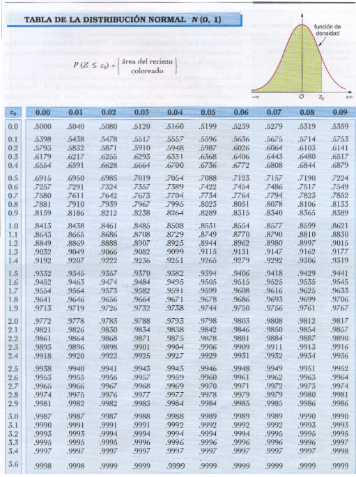
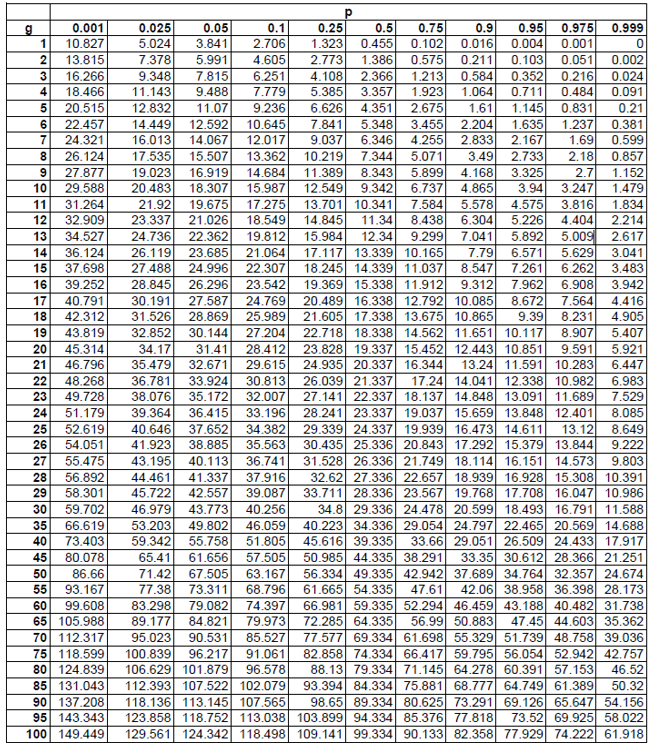
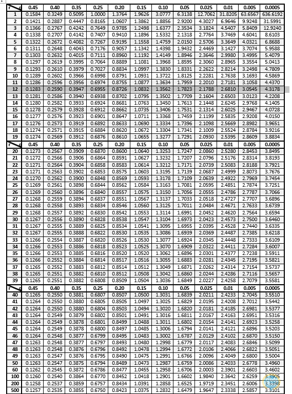

**Unidad de Investigación Científica y Académica, Facultad de Medicina,
Universidad de El Salvador**

[juan.vindell\@ues.edu.sv](mailto:juan.vindell@ues.edu.sv)

`r Sys.Date()`

```{r setup, include=FALSE}
knitr::opts_chunk$set(echo = TRUE)
```

<div style="text-align: justify">

# Introducción

Ya sea que un experimento produzca resultados cualitativos o cuantitativos, los métodos de análisis estadístico requieren enfocarse en ciertos aspectos numéricos de los datos (proporción muestral, la media o desviación estándar). El concepto de variable aleatoria permite pasar de los resultados experimentales a la función numérica de los resultados. Existen dos tipos fundamentalmente diferentes de variables aleatorias: las variables aleatorias discretas y las variables aleatorias continuas [@devore2009probabilidad].

# Variable aleatoria

Una variable aleatoria es una función que asocia un número real con cada elemento
del espacio muestral[@walpole2012probabilidad]. Además, nos sirven para modelar la magnitud que nosotros no sabemos cuanto valen, pero si tenemos información al respecto, es decir, puede estar en un entorno a un determinado valor de la magnitud, dichas variables aleatorias son modelos matemáticos no son algo de la naturaleza. Generalmente se representa con una letra mayúscula **X**, para denotar una variable aleatoria.

$$X: \Omega \to \mathbb{R}$$
asigna un número real $X(\omega)$ a cada elemento $\omega$ en un espacio de resultados.

**Ejemplo**

Lanzamiento de una moneda dos veces, definiremos **X** como al número de caras.

**Solución**

Para resolver este ejercicio debemos definir el espacio muestral al lanzar una moneda dos veces:

$$X = \{CC, CX, XC, XX \}$$
Por lo tanto, la variable aleatoria **X**, puede tomar los valores de 0, 1 y 2

```{r}
#Espacio muestral
lanzar_moneda <- c("CC","CX","XC","XX")

#Contar el número de caras
X <- c(2,1,1,0)

#Tabla de frecuencias
tabla<-table(X)
tabla

```


## Tipos de variables aleatorias

Las variables aleatorias se clasifican en discretas y continuas:

### Variables aleatorias discretas

Se dice que una variable aleatoria **X** es discreta, si el número de valores que puede tomar es contable(finito o infinito)[@canavos1987probabilidad].

**Ejemplo**, el número de caras obtenidas al lanzar dos monedas son: 0, 1 y 2.


### Variables aleatorias continuas

Se dice que una variable aleatoria **X** es continua, si puede asumir un número incontable de valores.

**Ejemplo**, si consideramos el experimento aleatorio consistente en medir la temperatura ambiente de una habitación y tomamos como variable aleatoria la magnitud de la temperatura de la habitación, esta puede tomar valores desde 10° hasta los 25°.

# Distribución de probabilidad

Es un modelo matemático que describe la forma en como varían los resultados de un experimento, en otras palabras nos da las probabilidades de todos los posibles resultados.

## Distribución de probabilidad discreta

Sea **X** una variable aleatoria discreta. Se llamará a $p(x)=P(X=x)$ *función de probabilidad* de la variable aleatoria **X**, si satisface las siguientes condiciones[@canavos1987probabilidad]:

1. $f(x) \geq 0$, para todos los valores x de X.

2. $\sum_{x} f(x)=1$

3. $P(X=x)=f(x)$

Hay muchos problemas donde queremos calcular la probabilidad de que el valor
observado de una variable aleatoria $X$ sea menor o igual que algún número real $x$.
Al escribir $F(x) = P(X ≤ x)$ para cualquier número real $x$, definimos $F(x)$ como la
función de la distribución acumulada de la variable aleatoria $X$[@walpole2012probabilidad].

La **función de la distribución acumulada $F(x)$** de una variable aleatoria discreta
$X$ con distribución de probabilidad $f(x)$ es:

$$F(x)=P(X \leq x)=\sum_{t \leq x }f(t)$$

**Ejemplo**

Consideremos un juego en el cual se lanza 2 veces una moneda, y el apostador gana $1 por cada cara que salga.

**Solución**

El espacio muestral está dado por los posibles resultados que se obtengan al lanzar dos veces una moneda: $CC, CX, XC, XX$, y la probabilidad de cada uno de ellos es de $(\frac{1}{2})^{2}=\frac{1}{4}$, entonce definieramos la variable aleatoria:

$$X=\mbox{ganancia del apostador}$$
Los valores que le corresponden a cada resultados del espacio muestral son:

* $CC = 2$

* $CX = 1$

* $XC = 1$

* $XX = 0$

Entonces, las probabilidades asociadas a cada resultado de la variable aleatoria son:

* $P(X=0)=P(XX)=\frac{1}{4}$

* $P(X=1)=P(\mbox{CX o XC})=\frac{1}{4}+\frac{1}{4}=\frac{1}{2}$

* $P(X=2)=P(CC)=\frac{1}{4}$


Además podemos comprobar que $\sum_{x} p(x)=1$, entonces

$$\sum_{x=0}^{2}P(X=x)=P(X=0)+P(X=1)+P(X=2)=\frac{1}{4}+\frac{1}{2}+\frac{1}{4}=1$$

```{r}
# Resultados y sus respectivas ganancias
resultados <- c("CC", "CX", "XC", "XX")
ganancias <- c(2, 1, 1, 0)
probabilidades <- rep(1/4, 4)  # Probabilidad de cada resultado

# Crear un data frame para visualizarlo mejor
distribucion <- data.frame(Resultado = resultados, Ganancia = ganancias, Probabilidad = probabilidades)

# Imprimir la distribución de probabilidad
print(distribucion)

# Calcular la probabilidad de obtener 0, 1 y 2 caras
prob_0_caras <- sum(probabilidades[ganancias == 0])
prob_0_caras
prob_1_cara <- sum(probabilidades[ganancias == 1])
prob_1_cara
prob_2_caras <- sum(probabilidades[ganancias == 2])
prob_2_caras

# Calcular la suma de las probabilidades
suma_probabilidades <- sum(prob_0_caras,prob_1_cara,prob_2_caras)
print(suma_probabilidades)

# Calcular la probabilidad acumulada
prob_acumulada_0 <- prob_0_caras
prob_acumulada_1 <- prob_acumulada_0 + prob_1_cara
prob_acumulada_2 <- prob_acumulada_1 + prob_2_caras

# Imprimir los resultados
cat("Probabilidad acumulada de obtener 0 caras:", prob_acumulada_0, "\n")
cat("Probabilidad acumulada de obtener 1 cara:", prob_acumulada_1, "\n")
cat("Probabilidad acumulada de obtener 2 caras:", prob_acumulada_2, "\n")

```

### Valor esperado de una variable aleatoria discreta

Está definido por:

$$E(X)= \mu = \sum_{i=1}^{R}x_{i}P(X=x_{i})$$

donde los $x_{i}^{´}s$ son los valores de la variable aleatoria con probabilidad positiva, y **R** puede tomar valores finitos e infinitos contables[@rosner2006fundamentals].


**Ejemplo**

Siguiendo con el ejemplo del lanzamiento de la moneda dos veces, calcularemos ahora el valor esperado.

**Solución**

Para calcular el valor esperado de este juego, primero debemos considerar los posibles resultados de lanzar una moneda dos veces. Los posibles resultados y sus correspondientes ganancias son los siguientes: $2,1,1,0$, además de eso cada uno tienen probabilidad de $\frac{1}{4}$, entonces:

$$
\begin{align}
E(x) &= 2(\frac{1}{4})+1 (\frac{1}{4})+1 (\frac{1}{4})+0 (\frac{1}{4}) \\
E(x) &= (\frac{2}{4})+(\frac{1}{4})+(\frac{1}{4})+0 \\
E(x) &= \frac{4}{4} \\
E(x) &= 1
\end{align}
$$

Por lo tanto, el valor esperado del juego es $1. Esto significa que, en promedio, el apostador puede esperar ganar $1 por cada vez que juegue


```{r}
# Definir las ganancias y sus probabilidades
ganancias <- c(2, 1, 1, 0)  # Ganancias para (CC, CCr, CrC, CrCr)
probabilidades <- c(1/4, 1/4, 1/4, 1/4)  # Probabilidades

# Calcular el valor esperado
valor_esperado <- sum(ganancias * probabilidades)

# Mostrar el resultado
print(valor_esperado)

```


### Varianza de una variable aleatoria discreta

La varianza de una variable aleatoria discreta, viene denotada por $Var(X)$[@rosner2006fundamentals]:

$$Var(X)=\sigma^{2}=\sum_{i=1}^{R}(x_{i}-\mu)P(X=x_{i})=E[X^2]-[E(X)]^2$$

donde los $x_{i}^{´}s$ son los valores para los cuales la variable aleatoria adquiere probabilidad positiva. La desviación estándar de una variable aleatoria $X$, denotada por $sd(X)$ o $\sigma$, es definido por la raíz cuadrada de su varianza.

**Ejemplo**

Seguiremos siempre con el ejemplo del lanzamiendo de la moneda dos veces, ahora calcularemos la varianza y desviación estándar respectivamente.


**Solución**

Ya sabemos, como lo hemos venido trabajando que la esperanza(valor esperado) del lanzamiento de la moneda dos veces es de 1, además que las $P(X=x_{i})=\frac{1}{4}$.

Entonces calcularemos $Var(X)=E[X^2]-[E(X)]^2$

El valor esperado es el siguiente:

$$
\begin{align}
E[X] &= \sum[E(x)*P(X)] \\
       &= 0(\frac{1}{4})+1(\frac{1}{2})+2(\frac{1}{4}) \\
       &= 1
\end{align}
$$

Hoy calculamos el valor esperado al cuadrado:

$$
\begin{align}
E[X^2] &= \sum[E(x)^{2}*P(X)] \\
       &= 0^2(\frac{1}{4})+1^2(\frac{1}{2})+2^2(\frac{1}{4}) \\
       &= \frac{3}{2}
\end{align}
$$
Finalmente, sustituimos los valores calculados en la fórmula $E[X^2]-[E(X)]^2$:

$$
\begin{align}
Var(X) &= \frac{3}{2}-(1)^2 \\
       &= \frac{1}{2}   
\end{align}
$$
La desviación típica será:

$$\sigma= \sqrt{Var(X)}= \sqrt{0.5}=0.707 $$

Por lo tanto, la desviación estándar de las ganancias en este juego es aproximadamente $0.707


```{r}
# Definir las ganancias y las probabilidades
ganancias <- c(2, 1, 0)  # Ganancias posibles
probabilidades <- c(1/4, 1/2, 1/4)  # Probabilidades correspondientes

# Calcular E(X)
E_X <- sum(ganancias * probabilidades)

# Calcular E(X^2)
E_X2 <- sum((ganancias^2) * probabilidades)

# Calcular la varianza
varianza <- E_X2 - (E_X^2)

# Calcular la desviación estándar
desviacion_estandar <- sqrt(varianza)

# Mostrar resultados
cat("Esperanza (E(X)):", E_X, "\n")
cat("Varianza:", varianza, "\n")
cat("Desviación estándar:", desviacion_estandar, "\n")


```


## Distribución de probabilidad continuas

Sea $X$ una variable aleatoria definida sobre un espacio muestral continuo $\Omega$, cuyos posibles valores pertenecen al conjunto $A$ incluido en el conjunto de los números reales $(A\subseteq \mathbb{R})$. Su función de densidad es una función que cumple las siguientes condiciones[@bacchini2018introduccion]:

1. $f(x) \geq 0$

2. $\int_{x\epsilon A}f(x)dx=1$

3. $P(a\leq X\leq b)=\int_{a}^{b}f(x)dx$

La **función de distribución acumulada $F(x)$** de una variable aleatoria continua
$X$ con función de densidad $f(x)$ es:

$$F(x)=P(X \leq x)=\int_{-\infty}^{x}f(t)dt, para -\infty \leq x \leq \infty$$

Como consecuencia inmediata se escriben los dos resultados:

+ $P(a < x < b)= F(b)-F(a)$

+ $f(x)=\frac{dF(x)}{dx}$


**Ejemplo**

Consideremos una variable aleatoria $X$ definida sobre el intervalo $[0,3]$, cuya función de densidad es:

$$f(x)=\frac{x^{2}}{9},0 \leq x \leq 3$$

Calcular la probabilidad $P(0\leq X\leq 1)$


**Solución**

Primeramente comprobemos que es una función de densidad

$$\int_{0}^{3}\frac{x^{2}}{9}dx=\frac{x^3}{27} \mid_{0}^{3}=1$$

Ahora comprobamos la probabilidad $P(0\leq X\leq 1)$

$$P(0\leq X\leq 1)=\int_{0}^{1}\frac{x^{2}}{9}dx=\frac{x^{3}}{27} \mid_{0}^{1}=\frac{1}{27}$$

Finalmente, calcularemos la función de acumulada:

$$F(x)=\int_{0}^{x}\frac{t^2}{9}dt \mid_{0}^{x}=\frac{x^{3}}{27}$$

Entonces la función acumulada es:

$$F(x) = \left\{
\begin{array}{ll}
0 & \text{si } x <0 \\
\frac{x^3}{29} & \text{si } 0 \leq x \leq 1 \\
1 & \text{si } x >0
\end{array}
\right.
$$

```{r}
# Definir la función
f <- function(x) {
  x^2 / 9
}

# Calcular la integral definida
resultado <- integrate(f, 0, 1)

# Mostrar el resultado
print(resultado$value)

```

La gráfica sería la siguiente:


```{r}
# Definir la función de densidad
f <- function(x) {
  x^2 / 9
}

# Definir la función de distribución acumulativa (CDF)
cdf <- function(x) {
  ifelse(x < 0, 0, ifelse(x > 1, 1, integrate(f, 0, x)$value))
}

# Crear un rango de valores de x
x_vals <- seq(0, 1, length.out = 100)
y_vals <- sapply(x_vals, cdf)

# Graficar la función de distribución acumulativa
plot(x_vals, y_vals, type = "l", col = "blue", lwd = 2,
     main = "Función de Distribución Acumulativa (CDF)",
     xlab = "x", ylab = "F(x)")
abline(h = 1, col = "red", lty = 2)  # Línea horizontal en 1
grid()

```

### Valor esperado de una variable aleatoria continua

El valor esperado de una variable aleatoria continua viene dado por:

$$\int_{-\infty}^{\infty}xf(x)dx$$

**Ejemplo**

Calcularemos el valor esperado del ejemplo anterior que viene definida por $f(x)=\frac{x^2}{9}, 0 \leq x \leq 1$


**Solución**

$$
\begin{align}
E(X) &= \int_{0}^{1}xf(x)dx \\
     &= \int_{0}^{1}x(\frac{x^2}{9})dx \\
     &= \frac{1}{9}\int_{0}^{1}x^3dx \\
     &= \frac{1}{9} \frac{x^4}{4} \mid_{0}^{1} \\
     &= \frac{x^4}{36} \mid_{0}^{1} \\
     &= \frac{1}{36}
\end{align}
$$


```{r}
# Definir la función
f <- function(x) {
  x^3 / 9
}

# Calcular la integral definida
vesperado <- integrate(f, 0, 1)

# Mostrar el resultado
print(vesperado$value)
```


### Varianza de una variable aleatoria continua

La varianza de una variable aleatoria continua viene dada por:

$$\sigma^2=\int_{-\infty}^{\infty}(x-\mu)^2f(x)dx= [ \int_{-\infty}^{\infty}x^2f(x)dx ]-\mu^2$$

La desviación estándar, es la raíz cuadrada de la varianza $\sqrt{Var(X)}=\sigma$.

**Ejemplo**

Del ejercicio anterior calcularemos la varianza y desviación estándar.

**Solución**

Debemos de calcular que $\sigma^2=[\int_{-\infty}^{\infty}x^2f(x)dx]-\mu^2$.

Ya conocemos $f(x)=\frac{x^2}{9};0 \leq x \leq 1$ y $\mu=\frac{1}{36}$, entonces sustituiremos dichos valores:

$$
\begin{align}
\sigma^2 &= [\int_{0}^{1}x^2(\frac{x^2}{9})dx]-(\frac{1}{36})^2 \\
         &= \frac{1}{9}[\int_{0}^{1}x^4dx]-(\frac{1}{36})^2 \\
         &= \frac{1}{9}[\frac{x^5}{5} \mid_{0}^{1}]-(\frac{1}{36})^2 \\
         &= \frac{1}{45}(x^5) \mid_{0}^{1} - (\frac{1}{36})^2 \\
         &= \frac{1}{45} - \frac{1}{1236} \\
         &= \frac{144-5}{6480} \\
         &= \frac{139}{648} \\
         & \approx 0.021451
\end{align}
$$


```{r}
# Definir la función 
f1 <- function(x) {
  x^3 / 9
}

# Calculamos el valor esperado de X
E_f1 <- integrate(f1, 0, 1)$value
E_f1 


# Calcular E[f(X)^2]
f2 <- function(x) {
  x^4 / 9
}

E_f2 <- integrate(f2, 0, 1)$value
E_f2


# Calcular varianza
varianza <- E_f2 - E_f1^2

# Desviacion estándar
Desviacion <- sqrt(varianza)


# Mostrar resultados
cat("Varianza:", varianza, "\n")
cat("Desviación estándar:", Desviacion, "\n")
```


# Algunas distribuciones de probabilidades importantes

En este apartado, abordaremos toda la parte de la inferencia estadística mediante el uso de R. La primera parte comprenderá trabajar con variables discretas, sus distribuciones y el cálculo de probabilidades y, posteriormente, se hará lo mismo con las variables continuas.

De esta manera, se estudiarán las principales distribuciones de probabilidad tanto discretas como continuas que se utilizan en la mayoría de las asignaturas de estadística.


## Distribuciones de probabilidad en R

El paquete `stats` implementa numerosas funciones para la realización de los cálculos asociados a las distintas distribuciones de probabilidades


Para cada distribución, **R** dispone de cuatro funciones. Se puede acceder a cada una de ellas simplemente precediendo el nombre de la distribución que figura en la tabla anterior por la letra que se indica a continuación:

- **d**: función de densidad o de probabilidad.

- **p**: función de distribución

- **q**: función para el cálculo de cuantiles.

- **r**: función para simular datos con dicha distribución.

A continuación mostramos las funciones con código R de las distribuciones de probabilidad:


## Tablas de distribuciones de probabilidades {.tabset}

### Discretas

| Distribución | Función de densidad | Función de distribución | Función de cuantiles | Simulaciones |
|-----------------|------------------------|-----------------------|----------------------|-----------------|
| Binomial   | dbinom   | pbinom  | qbinom  |  rbinom |
| Poisson    | dpois    | ppois   | qpois   |  rpois  |
| Geométrica | dgeom    | pgeom   | qgeom   |  rgeom  |
| Hipergeométrica   | dhyper   | phyper  | qhyper  |  rhyper |
| Binomial negativa   | dnbinom   | pnbinom  | qnbinom  |  rnbinom |

### Continuas

| Distribución | Función de densidad | Función de distribución | Función de cuantiles | Simulaciones |
|-----------------|------------------------|-----------------------|----------------------|-----------------|
| Normal     | dnorm   | pnorm  | qnorm  |  rnorm |
| Uniforme    | dunif    | punif   | qunif   |  runif  |
| Beta | dbeta    | pbeta   | qbeta   |  rbeta  |
| Gamma   | dgamma   | pgamma  | qgamma  |  rgamma |
| Weibull   | dweibull   | pweibull  | qweibull  |  rweibull |
| Exponencial   | dexp   | pexp  | qexp  |  rexp |
| Chi cuadrada   | dchisq   | pchisq  | qchisq  |  rchisq |
| T Student   | dt   | pt  | qt  |  rt |
| Fisher   | df   | pf  | qf  |  rf |


## Distribuciones de probabilidad discretas

### Distribución binomial

La distribución binomial es un modelo teórico de distribución de probabilidad discreta aplicable a aquellos experimentos en los que se realizan $n$ pruebas independientes, cada una de ellas con sólo dos resultados posibles(éxito o fracaso) y la misma probabilidad de éxito $p$. En tal caso, se dice que una variable aleatoria $X$ "*número de éxitos en las $n$ pruebas*" sigue una distribución binomial con parámetros $n$ y $p$ [@pastor2012bioestadistica]. 

Su función de densidad viene dada por:

$$f(X) \;=\; P(X=x)  \;=\; {n\choose x} p^x\, (1-p)^{n-x}, \qquad n=0,1,2, \ldots, n$$

**Ejemplo**

En un ensayo clínico se ha tomado un total de 50 pacientes y la probabilidad de que el paciente fume es $0.35$. Claramente,la variable aleatoria que
cuenta el número de pacientes fumadores sigue una distribución binomial de parámetros $n = 50$ y $p = 0.35$. Calcular la probabilidad de que:

a) Exactamente 20 pacientes sean fumadores.

b) Al menos 15 pacientes sean fumadores. 

c) Obtener la probabilidad de que entre 10 y 15 pacientes(ambosinclusive) sean fumadores.


**Solución**

Para calcular la probabilidad de que exactamente 20 pacientes sean fumadores en un ensayo clínico donde la variable aleatoria sigue una distribución binomial $B(n,p)$ con $n=50$ y $p=0.35$, utilizamos la fórmula de la distribución binomial:

$$P(X=x)={n\choose x} p^{x}(1-p)^{n-x}$$
donde:

+ $n$ es el número total de ensayos (pacientes).

+ $x$ es el número de éxitos (pacientes fumadores).

+ $p$ es la probabilidad de éxito (que un paciente fume)

+ ${n\choose x}$ es el coeficiente binomial que se calcula $\frac{n!}{x!(n-x)!}$

Sustituyendo los valores:

+ $n=50$

+ $x=20$

+ $p=0.35$

+ $1-p=0.65$

La probabilidad se calcula así:

$$P(X=20)={50\choose 20} 0.35^{20}(0.65)^{30}$$
Calculamos ${50\choose 20}$

$$ 
\begin{align}
{50\choose 20} &= \frac{50!}{20!(50-20)!} \\
               &= \frac{50!}{20!(30)!} \\
               &= 4.7129212243960
\end{align}
$$

Luego $(0.35)^{20} \approx 7.60958350158805×10^{−10}$  y $(0.65)^{30} \approx 2.44006108832541×10^{-6}$ 

Finalmente:

$$P(X=20)=(4.7129212243960)*(7.60958350158805×10^{−10})*(2.44006108832541×10^{-6}) \approx 0.08750881$$
Por lo tanto, la probabilidad de que exactamente 20 pacientes sean fumadores es aproximadamente del 8.75\%\.
 

Continuando con el ejemplo para resolver el literal **b)**, lo que se nos pide es calcular la $P[X \geq 15]$ entonces:

$$P[X \geq 15]=1-P[X<15]=1-P[X \leq14]$$

Luego, calculamos $P[X \leq14]$

$$P[X \leq 14]=\sum_{x=0}^{14}P(X=x), \mbox{con x=0,1,2,...,14}$$
El cálculo de esta probabilidad es algo complejo, por lo que se recomienda utilizar un software estadístico o una calculadora de distribución binomial (https://calculadorasonline.com/distribucion-binomial-probabilidad-binomial/)

$$P[X \leq 14] \approx 0.1878$$
Sustituyendo tenemos entonces que:

$$P[X \geq 15]=1-0.1878=0.812223$$

Finalmente, para el literal **c)** lo que nos piden es que $P[10 \leq X \leq 15]$

$$
\begin{align}
P[10 \leq X \leq 15] &= P[X \leq 15]-P[X<10] \\
                     &= P[X \leq 15]-P[X\leq 9]
\end{align}
$$


Haciendo cálculos tenemos:

+ $P[X \leq 15] = {50\choose 15}(0.35)^{15}(0.65)^{45} \approx 0.2801044$

+ $P[X \leq 10] = {50\choose 9}(0.35)^{9}(0.65)^{41} \approx 0.006697923$

Por lo tanto:

$$P[10 \leq X \leq 15]=0.2801044-0.6697923=0.2734065$$

```{r}
# Definimos los parametros
n <- 50
p <- 0.35

# a. Probabilidad de exactamente 20 fumadores
k <- 20
prob_exactamente_20 <- dbinom(k, n, p)
print(prob_exactamente_20)

# b. Probabilidad de al menos 15 fumadores
prob_al_menos_15 <- 1 - pbinom(14, n, p)
print(prob_al_menos_15)

# c. Probabilidad de entre 10 y 15 fumadores
prob_entre_10_y_15 <- pbinom(15, n, p) - pbinom(9, n, p)
print(prob_entre_10_y_15)

```


### Distribución Poisson

Se dice que una variable aleatoria $X$ sigue una distribución de Poisson de parámetro $\lambda$, si representa el número de sucesos independientes que ocurren a una velocidad constante sobre el tiempo o el espacio [@canavos1987probabilidad].

Su función de densidad viene dada por:

$$f(X)=\frac{e^{- \lambda} \lambda^{x}}{x!}, \lambda>0$$

**Ejemplo**

En un hospital el número medio de pancreatitis agudas atendidas por día es $0.90$. Es fácil comprobar que la variable aleatoria que cuenta el número de pancreatitis agudas atendidas por día sigue una distribución Poisson de parámetro $\lambda = 0.90$. Calcular:

a) La probabilidad de que en un día dado, el hospital atienda exactamente a 4 pacientes. 

b) La probabilidad de que, en un día cualquiera, el hospital atienda como máximo 2 pacientes.

c) La probabilidad de que, en un día dado, el hospital reciba entre 1 y 2 pacientes.


**Solución**

Para resolver este ejemplo nos apoyaremos en la fórmula de la distribución de Poisson antes mencionada, los valores que nos proporcionan es que:

+ $\lambda=0.90$

+ $x$ es el número de pacientes atendidos.

+ $e \approx 2.71828$ es la base del logaritmo natural.

Lo que nos están pidiendo en el literal **a)** es que $P[X=4]$, entonces sustituyendo tenemos que:

$$
\begin{align}
P(X=4) &=\frac{e^{- 0.90} (0.90)^{4}}{4!} \\
       &= \frac{(0.40657)(0.6561)}{24} \\
       & \approx \frac{0.2663}{24} \\
       & \approx 0.0111
\end{align}
$$

Entonces, la probabilidad de que el hospital atienda exactamente a 4 pacientes es aproximadamente 0.0111

Por otra parte, para el literal **b)** lo que nos piden es que $P[X \leq 2]$, entonces:

$$P(X \leq 2) = P(X=0)+P(X=1)+P(X=2)$$

Aplicamos

$$
\begin{align}
P(X=4) &=\frac{e^{- 0.90} (0.90)^{0}}{0!} + \frac{e^{- 0.90} (0.90)^{1}}{1!} + \frac{e^{- 0.90} (0.90)^{2}}{2!} \\
       &= 0.40657+0.36591+0.16466 \\
       & \approx 0.93714 
\end{align}
$$
Entonces, la probabilidad de que en un día cualquiera el hospital atienda como máximo 2 pacientes es aproximadamente 0.9371.


Finalmente, para el literal **c)** se nos pide que calculemos $P[1 \leq X \leq 2]$

$$
\begin{align}
P[1 \leq X \leq 2] &= P[X \leq 2]-P[X<1] \\
                     &= P[X \leq 2]-P[X\leq 0]
\end{align}
$$

Haciendo cálculos tenemos:

+ $P[X \leq 2] = \frac{e^{- 0.90} (0.90)^{2}}{2!} \approx 0.9371$

+ $P[X \leq 0] = \frac{e^{- 0.90} (0.90)^{0}}{0!}\approx 0.40657$

Por lo tanto:

$$P[1 \leq X \leq 2]=0.9371-0.40657=0.53057$$


```{r}
# Parámetro de la distribución
lambda <- 0.90

# 1. Probabilidad de atender exactamente a 4 pacientes
prob_exactamente_4 <- dpois(4, lambda)
cat("Probabilidad de atender exactamente 4 pacientes:", prob_exactamente_4, "\n")

# 2. Probabilidad de atender como máximo 2 pacientes
prob_maximo_2 <- ppois(2, lambda)
cat("Probabilidad de atender como máximo 2 pacientes:", prob_maximo_2, "\n")

# 3. Probabilidad de atender entre 1 y 2 pacientes
prob_entre_1_y_2 <- dpois(1, lambda) + dpois(2, lambda)
cat("Probabilidad de atender entre 1 y 2 pacientes:", prob_entre_1_y_2, "\n")

```


### Distribución geométrica

Para denotar que una variable aleatoria $X$ sigue una distribución geométrica, se usa $X \sim  Geom(𝑝), 𝑖 = 1, ⋯ , 𝑁$. La fórmula para hallar la distribución geométrica es (https://rpubs.com/dsalgadoh/910615):

$$P(X=x)=p(1-p)^{x-1}$$
Donde: $x = 1,2, \ldots$, es el número de fallas en una secuencia antes de que ocurra el primer éxito. $p$ es la probabilidad de éxito en cada prueba.

**Ejemplo**

La probabilidad de una alineación óptica con éxito en el montaje de un producto óptico, según
especificaciones para su almacenamiento, es de 0.8. Suponga que los intentos de montaje son
independientes.

a) ¿Cuál es la probabilidad de que la alineación con éxito se produzca por primera vez en el quinto ensayo?

b) ¿Cuál es la probabilidad de que la primera alineación con éxito requiera como mínimo cuatro
intentos?

c) ¿Cuál es la probabilidad de que la primera alineación con éxito requiera a lo menos cuatro y a lo más 6 intentos?

**Solución**

Para resolver este problema, utilizaremos la distribución geométrica, que modela el número de ensayos hasta el primer éxito en una serie de ensayos independientes.

**a)** La probabilidad de que la primera alineación con éxito ocurra en el quinto ensayo es dada por:

$$P(X=x)=p(1-p)^{x-1}$$
Donde:

+ $p=0.8$

+ $1-p=0.2$

+ $x=5$, número de ensayos hasta tener éxito.

Sustituimos lo valores y tenemos:

$$
\begin{align}
P(X=5) &= (0.8)(0.2)^{4} \\
       &= 0.8(0.0016) \\
       &= 0.00128
\end{align}       
$$

**b)** La probabilidad de que la primera alineación con éxito requiera al menos 4 intentos se puede calcular como:

$$P(X \geq 4)=1-P(X<4)=1-P(X \leq 3)$$
Pero $P(X<4)=P(X=1)+P(X=2)+P(X=3)$, entonces:

+ $P(X=1)=0.8$

+ $P(X=2)=0.16$

+ $P(X=2)=0.032$

Sustituyendo tenemos:

$$
\begin{align}
P(X \geq 4) &= 1-[P(X=1)+P(X=2)+P(X=3)] \\
            &= 1-[0.8+0.16+0.0032] \\
            &= 1-0.992 \\
            &= 0.008
\end{align}
$$

**c)** Nos piden $P(4 \leq X \leq 6)$

$$P(4 \leq X \leq 6)=P(X=4)+P(X=5)+P(X=6)$$
Ya conocemos que $P(X=5)=0.00128$, nos faltaría calcular $P(X=4)$ y $P(X=6)$  que es:

$$P(X = 4) = (0.8)(0.2)^{3}=0.0064$$

$$P(X = 6) = (0.8)(0.2)^{5}=0.000256$$

Sustituimos y obtenemos que:

$$
\begin{align}
P(4 \leq X \leq 6) &= P(X=4)+P(X=5)+P(X=6) \\
                   &= 0.0064+0.00128+0.000256 \\
                   &= 0.007936
\end{align}
$$


```{r}
# Parámetros
p <- 0.8
q <- 1 - p

# 1. Probabilidad de que el primer éxito sea en el 5to intento
prob_X_5 <- (q^(5-1)) * p
cat("P(X = 5):", prob_X_5, "\n")

# 2. Probabilidad de que el primer éxito requiera al menos 4 intentos
prob_X_ge_4 <- 1 - (p + (q * p) + (q^2 * p))
cat("P(X >= 4):", prob_X_ge_4, "\n")

# 3. Probabilidad de que el primer éxito esté entre 4 y 6 intentos
prob_X_4_to_6 <- (q^3 * p) + prob_X_5 + (q^5 * p)
cat("P(4 <= X <= 6):", prob_X_4_to_6, "\n")

```


### Distribución hipergeométrica

La distribución hipergeométrica surge a partir del “número de éxitos en $n$ ensayos dependientes de un experimento de Bernoulli” (https://rpubs.com/dsalgadoh/910615).

Un experimento hipergeométrico con parámetros $n$, $k$ y $N$ está basado en las siguientes condiciones:

+ Se elige una muestra sin reemplazo de $n$ elementos de un conjunto compuesto por $N$ elementos, de los cuales $k$ tienen una característica de interés.

+ Cada elemento se puede caracterizar como un "éxito" (el elemento tiene la característica de interés) o como un "fracaso" (el elemento no tiene la característica de interés).

Se dice que una variable aleatoria $X$ tiene una distribución hipergeométrica con parámetros $n$, $k$ y $N$, lo que se escribe: $X \sim Hg(𝑛,k,𝑁)$ , su función de densidad viene dada por:

$$ f(X) \;=\; P(X=x)\;= \;  \frac{{k\choose x}\,{N-k\choose n-x}}{{N\choose n}}, \qquad  \text{donde}\quad x=0,1,2, \ldots, n \quad, x \leq k \quad \text{y}\quad n-x \leq N-k $$


**Ejemplo**

Una cantidad de 75 componentes eléctricas están sujetas a control de calidad. Se encontró que 15 de las componentes estaban defectuosas y las restantes no lo estaban. Se escoge una muestra aleatoria de 5 componentes de este lote y sea $X$ el número de componentes defectuosos escogidos en la muestra. Resuelva los siguientes incisos, siempre escribiendo los resultados hallados en términos de $X$

a) La probabilidad de que el número de componentes defectuosos sea igual a 3.

b) La probabilidad de que el número de componentes defectuosos sea mayor que 3.

c) La probabilidad de que el número de componentes defectuosos se encuentre entre 1 y 4 (ambos no inclusive).


**Solución**

Los datos que nos proporcionan son los siguientes:

+ $N=75$, total de componentes.

+ $k=15$, componentes defectuosos.

+ $n=5$, tamaño de la muestra.

Entonces sustituyendolo en la distribución hipergeométrica tendremos:

$$ f(X) \;=\; P(X=x)\;= \;  \frac{{15\choose x}\,{75-15\choose 5-x}}{{75\choose 5}}$$
En el literal **a)** nos están pidiendo que $P(X=3)$ entonces:

$$P(X=3)\;= \;  \frac{{15\choose 3}\,{60\choose 2}}{{75\choose 5}}$$
Ahora calcularemos las combinatorias:

+ ${15\choose 3}=455$

+ ${60\choose 2}=1770$

+ ${75\choose 5}=17259390$


Sustituyendolo tenemos:

$$ 
\begin{align}
P(X=3) &= \frac{(455)(1770)}{17259390} \\
       &= \frac{805350}{17259390} \\
       &= 0.0466
\end{align}
$$
Por lo tanto, la probabilidad de que el número de componentes defectuosos sea igual a 3 es aproximadamente 0.0466.


Para el literal **b)** nos piden que $P(X \geq 3)$

$$P(X>3) \; = \; P(X=4) \; +\; P(X=5)$$

+ $P(X=4)=\frac{{15\choose 4}\,{60\choose 1}}{{75\choose 5}} =0.00475$

+ $P(X=5)=\frac{{15\choose 5}\,{60\choose 0}}{{75\choose 5}} =0.00017$

Sustituyendolo tenemos:


$$
\begin{align}
P(X > 3) &= P(X=4)+P(X=5) \\
         &= 0.00475+0.00017 \\
         &= 0.0049
\end{align}
$$

Es decir, la probabilidad de que el número de componentes defectuosos sea mayor que 3 es 0.0049.

Finalmente, en el literal **c)** nos piden que: $P(1 < X < 4)$

$$P(1<X<4)=P(X=2)+P(X=3)$$

Entonces:

+ $P(X=2)=\frac{{15\choose 2}\,{60\choose 3}}{{75\choose 5}} =0.20818$

+ $P(X=3)=\frac{{15\choose 3}\,{60\choose 2}}{{75\choose 5}} =0.04666$

Sustituyendolo tenemos:

$$
\begin{align}
P(1<X4) &= P(X=2)+P(X=3) \\
         &= 0.20818+0.04666 \\
         &= 0.2548
\end{align}
$$

Es decir, la probabilidad de que el número de componentes defectuosos se encuentre entre 1 y 4 (ambos no inclusive) es 0.2548.


```{r}
# Parámetros de la distribución
N <- 75  # Total de componentes
K <- 15  # Componentes defectuosos
n <- 5   # Tamaño de la muestra

# 1. Probabilidad de que el número de componentes defectuosos sea igual a 3
P_X_equals_3 <- dhyper(3, K, N - K, n)
cat("P(X = 3):", P_X_equals_3, "\n")

# 2. Probabilidad de que el número de componentes defectuosos sea mayor que 3
P_X_greater_than_3 <- dhyper(4, K, N - K, n) + dhyper(5, K, N - K, n)
cat("P(X > 3):", P_X_greater_than_3, "\n")

# 3. Probabilidad de que el número de componentes defectuosos esté entre 1 y 4 (exclusivo)
P_1_less_than_X_less_than_4 <- dhyper(2, K, N - K, n) + dhyper(3, K, N - K, n)
cat("P(1 < X < 4):", P_1_less_than_X_less_than_4, "\n")

```


### Distribución binomial negativa

La distribución binomial negativa es una distribución discreta, que simula el número de ensayos necesarios para producir un número específico de eventos. Cada prueba tiene dos posibles resultados. La distribución binomial negativa también puede modelar el número de no eventos que deben ocurrir para observar un número específico de resultados. Para representar que una variable aleatoria $X$ que sigue una distribución binomial negativa, se usa:  $X \thicksim BN(k,p)$ (https://rpubs.com/dsalgadoh/910615)

$$P(X = x) = {x-1 \choose k-1}p^k(1-p)^{x-k} \quad, x=0,1,2, \ldots , \quad k=1,2, \ldots$$

Donde $X$ es el número de ensayos independientes hasta obtener el $k-ésimo$ éxito y $p$, la probabilidad de éxito en los ensayos.


**Ejemplo**

Una refrigeradora tiene una probabilidad de 0.95\%\ de pasar un control de calidad. Se asume que los resultados del control de calidad de diferentes refrigeradoras son independientes. Calcular la probabilidad de que sea necesario revisar 20 refrigeradoras para que 15 pasen el control de calidad.

**Solución**

$X$ es el número de refrigeradoras hasta que 15 pasen el control de calidad. 

Los datos que se tienen son:

+ $x=20$

+ $k=15$

+ $p=0.95$

$$
P(X=20)={20-1 \choose
15-1}(0.95)^{15}(1-0.95)^{20-15} \\
P(X=20)={19 \choose 14}(0.95)^{15}(1-0.95)^{5} \\
P(X=20)=\frac{19!}{14!5!}(0.95)^{15}(1-0.95)^5 \\
P(X=20)=0.001683=0.1683%
$$

```{r}
x<-20
k<-15
p<-0.95
pbn<-dnbinom(x-k,size = k, prob = p)
paste0("La probabilidad de que será necesaria es ",format(100*pbn,digits = 3),"%.")
```


## Distribuciones de probabilidad continuas

### Distribución normal

Se dice que una variable aleatoria $X$ se encuentra normalmente distribuida si su función de densidad viene dada por [@canavos1987probabilidad]:

$$f(x)=\frac{1}{\sqrt{2 \pi \sigma^2}} e^{-\frac{1}{2 \sigma^2}(x-\mu)^2}$$
Donde sus parámetros son $\mu$ y $\sigma$.

**Distribución normal estándar**

La distribución de una variable aleatoria normal con media 0 y varianza 1 se llama
**distribución normal estándar** y viene definida por:

$$\phi = f(X, \mu, \sigma)=\frac{1}{\sqrt{2 \pi \sigma}}e^{-\frac{1}{2}X^{2}}$$


**Tipificación o normalización de la variable**

Para poder utilizar la tabla la variable $X$ que sigue una distribución $N \sim (\mu, \sigma)$ se tiene que transformar en otra variable $Z$ que tiene una distribución $N \sim (0,1)$ por lo que:

$$Z=\frac{X - \mu}{\sigma}$$

Existen tablas de la función de distribución de esta variable $N \sim (0,1)$. A continuación se muestra la tabla con sus valores.

```{r , fig.align='center', echo=FALSE, out.width = '85%'}

```


**Ejemplo**

Sea $X$ una variable aleatoria que representa la inteligencia medida por medio de pruebas CI. Si $X \sim \text{norm} (100,10)$, obtener las probabilidades de $X$ sea:

a) Mayor que 100.

b) Menor que 85.

c) A lo más 112.

d) Entre 95 y 120.


**Solución**

**a)** $P(X>100)=P(Z > \frac{100-100}{10})=P(Z>0)$

Dicho valor de $P(Z>0)$ lo buscamos en la tabla cuando $z=0.0$ y el valor que nos da es $P(Z>0)=0.5$


**b)** $P(X<85)=P(Z < \frac{85-100}{10})=P(Z<1.5)$

Ante de buscar el valor en la tabla, debemos de tener presente la siguiente propiedad que es si $P[z<-a]=1-P[z \leq a]$, entonces aplicandola a nuestro ejemplo tenemos que:

$P(Z<-1.5)$ si lo buscamos en la tabla el valor de $P(z \leq1.5)=0.9332$ y aplicando la propiedad antes mencionada tendremos que: $P(Z<-1.5)=1-0.9332=0.0668$


**c)** $P(X\leq112)=P(Z \leq \frac{112-100}{10})=P(Z\leq1.2)$

Buscamos el valor en la tabla de $P(Z \leq 1.2)=0.8849$


**d)** 

$$
\begin{align}
P(95<X<120) &= P(\frac{95-100}{10} < Z < \frac{120-100}{10})\\
            &= P(-0.5 < Z < 2) \\
            &= P(Z<2) - P(Z<-0.5) \\
            &= 0.9772 - (1-P[Z\leq0.5]) \\
            &= 0.9772 - (1-0.6915) \\
            &= 0.9772 - 0.3085 \\
            &= 0.6687
\end{align}
$$

```{r}
# Definimos los parámetros de la distribución normal
mu <- 100
sigma <- 10

# a. Probabilidad de X > 100
p_greater_100 <- 1 - pnorm(100, mean = mu, sd = sigma)
print(p_greater_100)

# b. Probabilidad de X < 85
p_less_85 <- pnorm(85, mean = mu, sd = sigma)
print(p_less_85)

# c. Probabilidad de X <= 112
p_less_equal_112 <- pnorm(112, mean = mu, sd = sigma)
print(p_less_equal_112)

# d. Probabilidad de 95 < X < 120
p_between_95_120 <- pnorm(120, mean = mu, sd = sigma) - pnorm(95, mean = mu, sd = sigma)
print(p_between_95_120)

```


### Distribución uniforme

Una variable aleatoria $X$ está distribuida uniformemente en $a \leq x \leq b$ si su función de densidad es:

$$f(x)= \frac{1}{b-a}$$ 

Mediante la función de distribución se calcula la probabilidad de que la variable aleatoria $X$ tome un valor $x$ de entre los posibles valores del intervalo $[a,b]$. Para una distribución continua, en general se calcula de esta manera:

$$P(a\leq X \leq b)=\int_{a}^{x}f(x)dx$$

En el caso de la distribución uniforme continua, dicha probabilidad $F(x)$ equivale al área del rectángulo cuya base es $(x-a)$ y su altura es $(b-a)$:

$$P(a\leq X \leq b)=\int_{a}^{x} \frac{1}{b-a}dx=\frac{x-a}{b-a}$$


**Ejemplo**

El tiempo medido en minutos que tarda una empresa en entregar un pedido de comida, es una variable aleatoria $X$ con distribucion uniforme en el intervalo $(50,90)$. 

a) Calcular la probabilidad de que la próxima entrega tarde a lo mucho 65 minutos.

b) Cuál es la probabilidad de que la próxima entrega tarde al menos 65 minutos.


**Solución**

Los valores que conocemos son $a=50$ y $b=90$, entonces:

**a)** Nos están pidiendo que $P(X\leq 65)$, aplicando la fórmula de la probabilidad tenemos que:

$$
\begin{align}
P(X\leq 65) &= \frac{65-50}{90-50} \\
            &= \frac{15}{40} \\
            &= 0.375
\end{align}
$$

También se puede resolver mediante integrales de la siguiente manera:

$$\int_{50}^{65}f(x)dx=\int_{50}^{65} \frac{1}{b-a}dx = \int_{50}^{65} \frac{1}{40}dx = \frac{1}{40} \int_{50}^{65}dx= \frac{1}{40} [x] \mid_{50}^{65} = \frac{65-50}{40} =0.375  $$


**b)** Nos piden $P(X \geq 65)$, entonces:

$P(X \geq 65)=1-P(X<65)= 0.625$

$$\int_{65}^{90}f(x)dx=\int_{65}^{90} \frac{1}{b-a}dx = \int_{65}^{90} \frac{1}{40}dx = \frac{1}{40} \int_{65}^{90}dx= \frac{1}{40} [x] \mid_{65}^{90} = \frac{90-65}{40} =0.625  $$


```{r}
# Definir los límites de la distribución
a <- 50
b <- 90

# a. Calcular la probabilidad de que X sea menor o igual a 65
prob_menor_65 <- punif(65, min = a, max = b)
prob_menor_65

# b. Calcular la probabilidad de que X sea mayor o igual a 65
prob_al_menos_65 <- 1 - prob_menor_65
prob_al_menos_65


```

### Distribución beta

La función beta está dada por:

$$B(\alpha, \beta)=\int_{0}^{1}x^{\alpha-1}(1-x)^{\beta -1}dx=\frac{\Gamma(\alpha) \Gamma({\beta})}{\Gamma(\alpha + \beta)}$$

Una variable aleatoria $X$ tendrá una distribución beta si su función de densidad viene dada por:

$$f(x)=\frac{1}{B(\alpha, \beta)}x^{\alpha-1}(1-x)^{\beta -1}$$


**Ejemplo**

La proporción de accidentes automovilísticos fatales que ocurren en México se pueden modelar mediante una variable aleatoria beta con los parámetros $\alpha=2$ y $\beta=4$.

a) Indica la función de densidad de la variable aleatoria.

b) Calcula la probabilidad de que menos del 40\%\ de los accidentes fatales.

**Solución**

Para el literal **a)** ya sabemos que la función de densidad de una distribución beta es: $f(x)=\frac{1}{B(\alpha, \beta)}x^{\alpha-1}(1-x)^{\beta -1}$, donde $B(\alpha, \beta)=\frac{\Gamma(\alpha) \Gamma({\beta})}{\Gamma(\alpha + \beta)}$, entonces sustituyendo los valores de $\alpha=2$ y $\beta=4$ tendremos:

Hay que recordar que $\Gamma(n)=(n-1)!$ por lo tanto:

+ $\Gamma(2)=1$, $\Gamma(4)=6$ y $\Gamma(6)=120$

Por lo tanto, $B(\alpha, \beta)=\frac{6}{120}=\frac{1}{20}$

Así, la función de densidad será:

$$f(x)=\frac{x(1-x)^{3}}{\frac{1}{20}}=20x(1-x)^{3}$$

Para el literal **b)** se nos pide $P(X<0.4)$ entonces:

$$P(X<0.4)= \int_{0}^{0.4}f(x)dx= \int_{0}^{0.4}20x(1-x)^{3}$$

Para resolver la integral primeramente expandimos $(1-x)^3=1-3x+3x^{2}-x^{3}$

$P(X<0.4)=20 \int_{0}^{0.4}x(1-3x+3x^{2}-x^{3})dx=20[\frac{1}{2}x^{2}-x^{3}+\frac{3}{4}x^{4}-\frac{1}{5}x^{5}] \mid_{0}^{0.4}=0.6630$

```{r}
# Parámetros de la distribución beta
a <- 2
b <- 4

# Calcular la probabilidad P(X < 0.4)
probabilidad <- pbeta(0.4, a, b)

# Mostrar el resultado
print(probabilidad)

```


### Distribución gamma

La función gamma viene dada por:

$$\Gamma(\alpha)=\int_{0}^{\infty}x^{\alpha-1}e^{-x}dx$$

Las propiedades importantes de esta función son:

$$\Gamma(1)=1  \; , \; \Gamma(n)=(n-1)! \; , \; \Gamma(\frac{1}{2})=\sqrt{\pi}$$

Por lo tanto, una variable aleatoria $X$ tendrá una distribución gamma con parámetros $\alpha$ y $\beta$, si su función de densidad es:

$$f(x)=\frac{1}{\beta^{\alpha} \Gamma(\alpha)}x^{\alpha-1}e^{-{\frac{x}{\beta}}}$$

donde $x>0$ y $\alpha, \beta >0$.

**Ejemplo**

Se sabe que la longitud de tiempo, en meses, entre las quejas de clientes por ciertos productos puede ser descrita con la distribución gamma con parámetros $\alpha=2$ y $\beta=4$.

a) ¿Qué probabilidad hay de que se presente un queja en más de 20 meses?.

b) ¿Cuál es la probabilidad de recibir una queja entre 15 y 18 meses?.

**Solución**

$X \sim Gamma(2,4)$ sustituyendo estos valores, calcularemos la función de densidad:

$$f(x)=\frac{1}{4^{2} \Gamma(2)}x^{2-1}e^{-{\frac{x}{4}}}$$

$\Gamma(2)=(2-1)!=1$ entonces:

$$f(x)=\frac{1}{16}xe^{-{\frac{x}{4}}}$$

En el literal **a)** nos piden $P(X>20)$:

$$P(X>20)=\int_{20}^{\infty}\frac{1}{16}xe^{-{\frac{x}{4}}}=\frac{1}{16}[-4xe^{-{\frac{x}{4}}}-16e^{-{\frac{x}{4}}}] \mid_{20}^{\infty}=0.0404$$

Otra manera de hacerlo seria:

$$P(X>20)=1-p(X<20)=\int_{0}^{20}\frac{1}{16}xe^{-{\frac{x}{4}}}$$

Finalmente, en el literal **b)** nos piden $P(15<X<18)$

$$P(15<X<18)=\int_{15}^{18}\frac{1}{16}xe^{-{\frac{x}{4}}}=\frac{1}{16}[-4xe^{-{\frac{x}{4}}}-16e^{-{\frac{x}{4}}}] \mid_{15}^{18}=0.0506$$

```{r}
# Parámetros
alpha <- 2
beta <- 4

# a. Cálculo de P(X > 20)
p_greater_than_20 <- 1 - pgamma(20, shape = alpha, scale = beta)
p_greater_than_20

# b. Cálculo de P(15 < X < 18)
p_between_15_and_18 <- pgamma(18, shape = alpha, scale = beta) - pgamma(15, shape = alpha, scale = beta)
p_between_15_and_18


```


### Distribución de Weibull

Sea $X$ una variable aleatoria que sigue una distribución de Weibull con parémeros $\alpha$ y $\lambda$ con una función de densidad:

$$f(x)=\frac{\alpha}{\lambda}x^{\alpha - 1}e^{-(\frac{x}{\lambda})^{\alpha}}$$

La función de distribución se obtiene por la integración de la función de densidad y es la siguiente:

$$F(x)=P(X\leq x)=1-e^{- (\frac{x} {\lambda})^{\alpha}}$$

**Ejemplo**

El tiempo de vida $X$, en horas, de un artículo en un taller mecánico tiene una distribución de Weibull con $\alpha=0.01$ y $\lambda=2$. ¿Cuál es la probabilidad de que falle antes de 8 horas de uso?

**Solución**

Nos dan $\alpha=0.01$, $\lambda=2$ y $x=8$, sustituimos en la función de distribución y tenemos que:

$$
\begin{align}
F(8) &= 1-e^{-(\frac{8} {2})^{0.01}}\\
     &= 1-e^{-(4)^{0.01}}\\
     &= 1-e^{-(1.014)}\\
     &= 1-0.362 \\
     &= 0.638
\end{align}
$$

```{r}
# Parámetros de la distribución
alpha <- 0.01  # Forma
lambda <- 2    # Escala
x <- 8         # Tiempo en horas

# Cálculo de la probabilidad
probabilidad <- pweibull(x, shape = alpha, scale = lambda)

# Mostrar el resultado
probabilidad

```


### Distribución exponencial

La distribución exponencial, es particularmente útil en situaciones donde estamos interesados en el tiempo que transcurre hasta que ocurre un evento específico.

Por ello, la función de densidad de una variable aleatoria $X$ sigue una distribución exponencial con parámetos $\lambda$ (tasa de ocurrencia) donde:

$$f(x)=\lambda e^{-\lambda x}$$
Con una función de distribución:

$$P(X \leq x)=1-e^{-\lambda x}$$
**Ejemplo**

El tiempo que tarda para cargar un camión obedece a una distribución exponencial, la media del tiempo de espera para cargarlo es de 15 minutos. ¿Cuál es la probabilidad de que la carga de un camión dure 6 minutos o menos?

**Solución**

Para resolver este problema, primero necesitamos establecer el parámetro $\lambda$ de la distribución exponencial.

El valor que nos dan es el tiempo medio de espera $\mu=15$, entonces $\lambda=\frac{1}{\mu}=\frac{1}{15}$. Ahora, queremos encontrar la probabilidad de que el tiempo de carga $X$ sea de 6 minutos o menos, es decir, $P(X \leq 6)$, para ello utilizaremos la función de distribución:

$$
\begin{align}
P(X \leq 6) &= 1-e^{-\lambda x}\\
     &= 1-e^{-\frac{1}{15}(6)} \\
     &= 1-e^{-0.4} \\
     &= 1-0.6703 \\
     &= 0.3297
\end{align}
$$

Así que la probabilidad de que la carga de un camión dure 6 minutos o menos es aproximadamente del 32.97\%\.


```{r}
# Parámetro de la distribución
media <- 15  # minutos
lambda <- 1 / media  # Tasa

# Tiempo que queremos evaluar
tiempo <- 6  # minutos

# Calcular la probabilidad
probabilidad <- pexp(tiempo, rate = lambda)

# Mostrar el resultado
cat("La probabilidad de que la carga dure 6 minutos o menos es:", probabilidad, "\n")

```


### Distribución de ji-cuadrada ($\chi^{2}$)

Sea $\chi^{2}$ una variable aleatoria continua, que se define como la suma de $n$ variables independientes ($\chi^{2}=Z_{1}^{2}+Z_{2}^{2}+ \ldots + Z_{n}^{2}$) donde, $n$ son los grados de libertad y $Z_{i}^{2} \sim N(0,1)$.

Su función de densidad viene dada por:

$$f(x)=\frac{1}{\Gamma(\frac{n}{2})} (\frac{1}{2})^{\frac{n}{2}}x^{\frac{n}{2}-1}e^{- \frac{x}{2}}$$
Para poder generar una función de probabilidad es muy complicado, por ello nos valdremos de tablas de probabilidad.

```{r , fig.align='center', echo=FALSE, out.width = '75%'}

```


**Ejemplo**

* **Caso 1** Sea $X$ una variable aleatoria que sigue una distribución chi cuadrada con $3$ grados de libertad, necesitamos calcular la $P(X \geq0.216)$.

* **Caso 2** Sea $X$ una variable aleatoria que sigue una distribución chi cuadrada con $15$ grados de libertad, necesitamos calcular la $P(X < 11.04)$.

* **Caso 3** Sea $X$ una variable aleatoria que sigue una distribución chi cuadrada con $21$ grados de libertad, necesitamos calcular la $P(11.59 \leq X \leq 20.34)$.


**Solución**

La tabla de la $\chi^2$ antes mencionada da las probabilidades pero cuando $P(X \geq x)$ caso contrario si nos piden $P(X \leq x)$ debemos de hacer el cálculo $1-P(X \geq x)$

Para solventar cada uno de los casos mediante la tabla, lo primero que tenemos que hacer es buscar en la tabla de la distribución $\chi^{2}$ los grados de libertad, que están en la primer columna, luego una vez encontrado o aproximado el valor en toda la fila buscamos el valor que le corresponde y arriba de esa columna aparece la probabilidad que le sería proporcionado.

+ **Caso 1**

$P(X \geq 0.216)=0.975$, ese valor lo encontramos automáticamente en la tabla, porque como mencionamos antes, nos dan las probabilidades $P(X \geq x)$.

Esto significa que hay un 97.5\%\ de probabilidad de que $X$ sea mayor o igual a $0.216$.


+ **Caso 2**

$P(X < 11.04)$, primeramente buscamos la columna con $g.l=15$, luego en la fila encontramos un valor aproximado que es $11.037$ con una probabilidad que la buscamos hacia arriba de esa columna y nos da 0.75. Ahora bien, mencionamos que esta tabla, solo nos proporciona probabilidades mayores a $x$, en todo caso tendremos que recurrir a $P(X < x)=1-P(X \geq x)$.

Por lo tanto, $P(X < 11.04)=1-P(X \geq 11.04)=1-0.75=0.25$, quiere decir que el 25\%\ de las probabilidades son menores a $11.04$.


+ **Caso 3**

$$
\begin{align}
P(11.59 \leq X \leq 20.34) &= P( X \geq 20.59)-P(X \leq 11.59) \\
                           &= P( X \geq 20.59)-[1-P(X \geq 11.59)] \\
                           &= 0.5 - [1-0.95] \\
                           &= 0.5 - 0.05 \\
                           &= 0.45
\end{align}
$$


```{r}
#caso 1
P_mayor_igual_0.216 <- 1-pchisq(0.216, 3)
P_mayor_igual_0.216

#caso 2
P_menor_11.04 <- pchisq(11.04,15)
P_menor_11.04

#caso 3
pchisq(20.34, 21) - pchisq(11.59, 21)
```


### Distribución t Student

Si una variable aleatoria tiene la función de densidad:

$$f(x)=\frac{\Gamma(\frac{n+1}{2})(1+ \frac{x^2}{n})^{-\frac{n+1}{2}}}{\Gamma(\frac{n}{2}) \sqrt{n \pi}}$$

se afirma que tiene una distribución $t$ con $n$ grados de libertad, lo que se abrevia como $t_{n}$.

Sea $X \sim N(0,1)$ y $V$ una variable $\chi^{2}$ con $n$ grados de libertad. Si $X$ y $V$ son independientes, entonces la variable aleatoria es:

$$T=\frac{X}{\sqrt{\frac{V}{n}}}$$

Ocuparemos la siguiente tabla para calcular su probabilidad $P(T \geq t_{n})$.

```{r , fig.align='center', echo=FALSE, out.width = '75%'}

```


**Ejemplo**

* **Caso 1** Sea $X$ una variable aleatoria que sigue una distribución t con $10$ grados de libertad, necesitamos calcular la $P(X \geq 1.37)$.

* **Caso 2** Sea $X$ una variable aleatoria que sigue una distribución t con $10$ grados de libertad, tal que $P(X \geq x)=0.025$.

* **Caso 3** Sea $X$ una variable aleatoria que sigue una distribución t con $9$ grados de libertad, necesitamos calcular la $P(X \leq 3.25)$.


**Solución**

De la misma manera que se utilizó la tabla de la $\chi^{2}$, en este caso de la $t$ es igual donde los valores que nos proporcionan son los $P(X\geq x)$

+ **Caso 1**

$P(X \geq 0.1.37)=0.10$, ese valor lo encontramos automáticamente en la tabla, porque como mencionamos antes, nos dan las probabilidades $P(X \geq x)$.

+ **Caso 2**

$P(X \geq x)=0.025$, lo que nos está pidiendo es que, ¿cuál es el percentil de tal manera que la probabilidad de que $X \geq x$ sea igual a $0.025$, entonces:

Anteriormente, lo que haciamos es buscar los grados de libertad, luego una vez identificado ver donde estaba ese valor y finalmente, buscabamos la probabilidad. Hoy haremos todo lo contrario, tenemos la probabilidad que es $0.025$, y los grados de libertad que es $10$, finalizamos viendo cual es ese valor que es $2.228$

+ **Caso 3**

$P(X \leq 3.25)$, acordemosnos que los valores de la tabla son cuando $P(X\geq x)$ y para nuestro caso es lo contrario, donde tendremos que utilizar la propiedad cuando $P(X \leq x)=1-P(X \geq x)$

Por lo tanto, $P(X \leq 3.25)=1-P(X \geq 3.25)=1-0.005=0.995$


### Distribución F

Sea $X \sim \chi_{\nu_{1}}^{2}$, $X \sim \chi_{\nu_{2}}^{2}$ tal que $X$ y $Y$ siguen una distribución chi cuadrada con  $\nu_{1}$ y $\nu_{2}$ grados de libertad, entonces:

$$\frac{X/\nu_{1}}{Y/\nu_{2}} \sim F_{\nu_{1},\nu_{2}}$$

Tienen una distribución de densidad de la siguiente manera:

$$f(x)=\frac{\Gamma(\frac{\nu_{1}+\nu_{2}}{2})}{\Gamma(\frac{\nu_{1}}{2})\Gamma(\frac{\nu_{2}}{2})}(\frac{\nu_{1}}{\nu_{2}})^{\frac{\nu_{1}}{2}} \frac{X^{\frac{\nu_{1}-2}{2}}}{(1+ \frac{\nu_{1}x}{\nu_{2}})^{\frac{\nu_{1}+\nu_{2}}{2}}}$$
Dado que su integral es muy complicada, entonces recurriremos a tablas de probabilidades. Ver https://rucrespo.wordpress.com/wp-content/uploads/2013/06/tablas-de-estadc3adstica.pdf

Hay que tener presente que las tablas **F** son muy amplias, debido a los diferentes valores de $\alpha$, va a depender que valor es el que necesitamos.

**Ejemplo**

a) Sea $X$ una variable aleatoria que sigue una distribución $F$ con $2$ grados de libertad en el numerador y $1$ grado de libertad en el denominador. Calcular $P(X>199.5)$.

b) Encuentre el valor de $k$ para $P(X_{5,7} > k)=0.005$, donde $X$ sigue una distribución de probabilidad $F$.

**Solución**

Para el caso **a)** debemos de buscar en la tabla el valor de $199.5$ con 2 grados de libertad en el numerador y 1 grado de libertad en el denominador, entonces el valor resultante, luego de buscarlo en la tabla es un $\alpha=0.05$

El caso **b)** es diferente ya que el valor $k$ que debemos encontrar dado los valores que nos proporcionan que son $\alpha=0.005$, con $5$ grados de libertad en el numerador y $7$ grados de libertad en el denominador. Entonces el valor que tiene todas estas características es de $k=9.5222$


```{r}
# Grados de libertad
df1 <- 2  # Numerador
df2 <- 1  # Denominador

# Calcular P(X > 199.5)
p_value <- 1 - pf(199.5, df1, df2)
p_value

```


```{r}
# Grados de libertad para este problema
df1 <- 5  # Numerador
df2 <- 7  # Denominador

# Encontrar el valor k
k_value <- qf(0.995, df1, df2)
k_value

```


# Bibliografía


<div/>