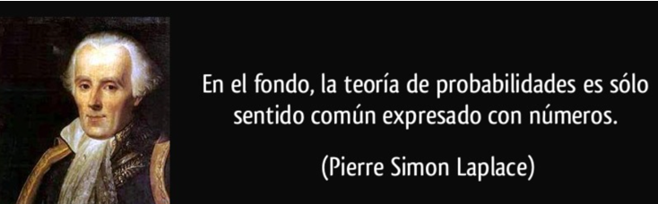
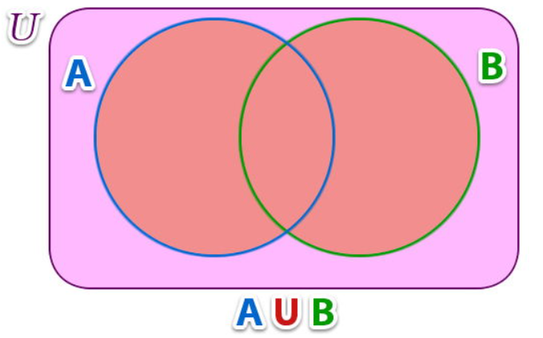

**Unidad de Investigación Científica y Académica, Facultad de Medicina,
Universidad de El Salvador**

[juan.vindell\@ues.edu.sv](mailto:juan.vindell@ues.edu.sv)

`r Sys.Date()`

```{r setup, include=FALSE}
knitr::opts_chunk$set(echo = TRUE)
```



La probabilidad y la estadística están relacionadas en una forma importante. La probabilidad
se emplea como herramienta; permite que usted evalúe la confiabilidad de sus
conclusiones acerca de la población cuando tenga sólo información muestral.[@mendenhall2007probabilidad]

# Espacio muestral, Elemento, Suceso aleatorio

<div style="text-align: justify">

Se denominan experimentos estocásticos, aleatorios o no determinísticos
a aquellos en los que pueden obtenerse resultados distintos cuando se
repiten en idénticas circunstancias. Los fenómenos biológicos tienen en
este sentido una componente aleatoria importante. La herramienta
matemática que constituye la base para el estudio de fenómenos con una
componente aleatoria es la teoría de la probabilidad, que proporciona
modelos teóricos aplicables a la frecuencia de los distintos resultados
de un experimento [@pastor2012bioestadistica].

## Espacio muestral

El conjunto de todos los resultados posibles de un experimento estadístico se llama **espacio muestral** y se representa con el símbolo $S$ [@walpole2012probabilidad].

**Ejemplo**

Consideremos un experimento de lanzar un dado

**Solución**

Los posibles resultados son $S= \{1,2,3,4,5,6 \}$

```{r}
# Definir el espacio muestral para el lanzamiento de una moneda
S <- c(1,2,3,4,5,6)

# Mostrar el espacio muestral
print(S)

```


## Elemento

Se denomina *elemento* a cada resultado en un espacio muestral o miembro del espacio muestral. 

**Ejemplo**

Siempre con el experimento del dado.

**Solución**

Dado que el espacio muestral del dado es $S= \{1,2,3,4,5,6 \}$. Entonces el número 2 es un elemento.

```{r}
# Definir el espacio muestral para el lanzamiento de un dado
S <- c(1, 2, 3, 4, 5, 6)

# Extraer el segundo elemento del espacio muestral
elemento <- S[2]

# Mostrar el segundo elemento
print(elemento)

```

## Eventos o sucesos aleatorios

Es un subconjunto del espacio muestral. Pueden contener uno o más elementos del espacio muestral, bajo ciertas condiciones.

**Ejemplo**

Siempre con el lanzamiendo del dado, consideraremos el evento de que al lanzar el dado nos salga un número par.

**Solución**

Para este caso consideremos el evento $A$ como el conjunto de los resultados que se obtiene un número par.

$$A= \{2,4,6 \}$$


```{r}
# Definir el espacio muestral para el lanzamiento de un dado
espacio_muestral <- c(1, 2, 3, 4, 5, 6)

# Definir un evento, por ejemplo, obtener un número par
A <- c(2, 4, 6)

# Mostrar los elementos y el evento
print(paste("Evento de obtener un número par:", paste(A, collapse = ", ")))

```


En algunos experimentos es útil listar los elementos del espacio
muestral de forma sistemática utilizando un diagrama de árbol.

**Ejemplo**

Suponga que de un proceso de fabricación se seleccionan tres artículos
de forma aleatoria. Cada artículo se inspecciona y clasifica como
defectuoso, $D$, o sin defectos (no defectuoso), $N$. Calcularemos:

+ El espacio muestral mediante un diagrama de árbol

+ Obtener el 3 elemento.

+ Obtener el 1 y 6 elemento

+ El evento exactamente dos artículos defectuosos.

**Solución**

```{r,warning=FALSE}
library(DiagrammeR)
graph <- "
digraph tree {
  node [shape=box, fontname=Helvetica, fontsize=10]
  
  // Nodos
  A [label='Artículo']
  B [label='D']
  C [label='N']
  D [label='D']
  E [label='N']
  F [label='D']
  G [label='N']
  H [label='D']
  I [label='N']
  J [label='D']
  K [label='N']
  L [label='D']
  M [label='N']
  N [label='D']
  O [label='N']
  P [label='DDD',shape = ellipse, color = red]
  Q [label='DDN',shape = ellipse, color = red]
  R [label='DND',shape = ellipse, color = red]
  S [label='DNN',shape = ellipse, color = red]
  T [label='NDD',shape = ellipse, color = red]
  U [label='NDN',shape = ellipse, color = red]
  V [label='NND',shape = ellipse, color = red]
  W [label='NNN',shape = ellipse, color = red]
  
  
  // Estructura del árbol
  A -> B 
  A -> C 
  B -> D 
  B -> E 
  C -> F 
  C -> G 
  D -> H
  D -> I
  E -> J
  E -> K
  F -> L
  F -> M
  G -> N
  G -> O
  H -> P
  I -> Q
  J -> R
  K -> S
  L -> T
  M -> U
  N -> V
  O -> W
  
}
"

#CREAMOS EL GRAFICO
grViz(graph)
```

Vemos que el espacio muestral es
$S = \{DDD, DDN, DND, DNN, NDD, NDN, NND, NNN\}$. Otra manera de hacerlo
en R, es la siguiente:

```{r,warning=FALSE}
library(probs)
urnsamples(c("D","N"),size=3,replace=T,ordered=T)
```

**Otra forma**

```{r}
# Definir el espacio muestral para tres artículos que pueden ser defectuosos (D) o no defectuosos (N)
espacio_muestral <- c("NNN", "NND", "NDN", "NDD",
                      "DNN", "DND", "DDN", "DDD")

# Mostrar el espacio muestral
print(espacio_muestral)

# 3er elemento del espacio muestral
elemento <- espacio_muestral[3]

#Mostrar el elemento
print(elemento)

#1er y 6to elemento del espacio muestral
elemento16 <- espacio_muestral[c(1,6)]

#Mostrar el elemento
print(elemento16)


# Ejemplos de eventos:
# Evento: Exactamente dos artículos son defectuosos
evento_exactamente_dos_defectuosos <- c("NDD", "DND", "DDN")

# Mostrar los eventos
print(evento_exactamente_dos_defectuosos)

```


## Operaciones de sucesos

-   El suceso **unión** $A \cup B$ es el evento constituido por los
    elementos que pertenecen a $A$ o $B$, o a ambos a la vez.
    
```{r , fig.align='center', echo=FALSE, out.width = '50%'}

```


-   El suceso **intersección** $A \cap B$ es el evento formado por los
    elementos que pertenecen simultáneamente a $A$ y $B$.
    
```{r , fig.align='center', echo=FALSE, out.width = '50%'}

```


-   Sucesos **disjuntos**, **incompatibles** o **mutuamente
    excluyentes** son aquellos que no pueden ocurrir simultáneamente; es
    decir, su intersección es el conjunto vacío,
    $A \cap B = \varnothing$.

    
```{r , fig.align='center', echo=FALSE, out.width = '50%'}

```

-   El conjunto que consiste en todos los elementos de $A$ que no pertenecen a $B$ se denomina     *diferencia*

```{r , fig.align='center', echo=FALSE, out.width = '50%'}

```

-   El suceso **complementario** del suceso $A$, denotado por $A^{c}$,
    es el evento que ocurre cuando no se realiza $A$.
    
```{r , fig.align='center', echo=FALSE, out.width = '50%'}

```

A veces es útil visualizar un experimento usando una imagen llamada
**diagrama de Venn** [@mendenhall2007probabilidad].


Ahora bien, para aplicar las operaciones de conjunto mediante el
diagrama de Venn, realizaremos el siguiente planeamiento.

**Ejemplo**

Sea $A= \{1,2,3,4,5 \}$ y $B= \{4,5,6,7,8,9 \}$ queremos realizar las operaciones de conjunto con dichos elementos

```{r}
#Creamos el vector A y B respectivamente
A <- 1:5
A
B <- 4:9
B
```

```{r}
m <- union(A,B) #union de los conjuntos A y B
m

n <- intersect(A,B) #interseccion de los conjuntos A y B
n

p <- setdiff(A,B) #diferencia de los conjuntos A y B
p

t <- setdiff(union(A, B), A) #complemento de A
t
```

Mediante el diagrama de Venn tendremos:

```{r, warning=FALSE, message=FALSE}
library(ggvenn)

x<-list("A" = c(1:5), "B" = c(4:9))

ggvenn(x,
       show_elements = TRUE,
       fill_color = c("#54ff9f","#6a5acd"),
       text_size = 8,
       stroke_size = 2,
       label_sep = " ")
```


# Principio fundamental de conteo

Si un experimento consta de $k$ sucesos encadenados. El primer suceso
puede suceder de $n_{1}$ maneras distintas, el segundo suceso puede
ocurrir de $n_{2}$ maneras distintas, y así sucesivamente hasta
completar los $k$ sucesos de que consta el experimento.

El número de posibles resultados es igual al producto:
$n_{1}x n_{2} x \ldots x n_{k}$. Este principio también es conocido como
*principio de multiplicación* [@caceres2007estadistica].

Una de las preguntas fundamentales que nos debemos de hacer al utilizar técnicas de conteo es que: **¿importa el orden de los elementos?**.

Para responder a esta pregunta debemos de tener presente dos cosas:

1. Si no nos importa el orden trabajaremos con las *combinaciones*.

2. Si nos importa el orden trabajaremos con las *permutaciones*.

## Combinaciones

Como lo mencionamos anteriormente, entonces, en las combinaciones no importa el orden en que se acomodan los elementos seleccionados. 

Por ello, Cáceres (2007) denomina las  combinaciones de $m$ elementos distintos tomados $n$ a $n$, siendo $n \leqslant m$, a todos los grupos que se pueden
formar considerando dos grupos distintos si difieren en la cualidad de
algún elemento, no importando el orden en que se encuentren. En el caso
de que los elementos no puedan repetirse las combinaciones son sin
repetición.

$$C_{m,n}=\binom{m}{n} = \frac{m!}{n!(m - n)!}$$

donde:

* $m$ es el número total de elementos.

* $n$ es el número de elementos a seleccionar.

**Ejemplo**

Se tienen los 4 ases de una baraja y se quieren tomar al azar dos
cartas. Cuántas y cuáles son las combinaciones que pueden resultar?

**Solución**

$m = 4$ Número cartas para escoger

$n = 2$ Número de cartas en cada combinación

$$\begin{align}
C_{4,2} &= \frac{4!}{2!(4-2)!}  \\
C_{4,2} &= \frac{4x3x2x1}{(2x1)*(2x1)} \\
C_{4,2} &= \frac{24}{4} \\
C_{4,2} &= 6
\end{align}
$$

En R lo solventamos de la siguiente manera:

```{r}
# Definir las cartas (ases)
cartas <- c("As de espadas", "As de corazones", "As de diamantes", "As de tréboles")

# Calcular todas las combinaciones de 2 cartas de las 4 disponibles
combinaciones <- combn(cartas, 2, simplify = FALSE)

# Mostrar el número total de combinaciones
num_combinaciones <- length(combinaciones)
print(num_combinaciones)

# Mostrar las combinaciones
print(combinaciones)
```

Cuando queremos hacer combinaciones con reposición, estaremos contando de cuántas maneras diferentes podemos formar subconjuntos de tamaño $n$, a partir de un conjunto de $m$ elementos, donde cada uno puede ser seleccionado más de una vez.


$$\binom{m+n-1}{n}$$

donde:

* $m$ es el número total de elementos.

* $n$ es el número de elementos a seleccionar.


**Ejemplo**

En una pastelería hay 6 tipos distintos de pasteles. ¿De cuántas formas
se pueden elegir 4 pasteles?.

**Solución**

Para este caso $m=6$ y $n=4$, entonces aplicando la fórmula tenemos:

$$\binom{6+4-1}{4} = \binom{9}{4}$$

Ahora aplicaremos la fórmula de la combinatoria donde: 

$$C_{9,4}=\binom{9}{4} = \frac{9!}{4!(9 - 4)!}$$

Calculamos los factoriales

$$\begin{align}
9! &= 362880  \\
4! &= 24 \\
5! &= 120 \\
\end{align}
$$

Sustituimos la fórmula y obtenemos que:

$$\binom{9}{4}=\frac{362880}{24*120}=\frac{362880}{2880}=126$$


```{r}
library(probs)

m<-6
n<-4

c2<-nsamp(m,n,replace = T,ordered = F)
paste("Se pueden elegir",c2,"combinaciones 4 pasteles de los 6 distintos tipos")
```

## Permutaciones

Las permutaciones son las ordenaciones que se pueden formar con **todos los elementos** de un conjunto. 

**Ejemplo**

Con las fichas 853. ¿Cuántos números de 3 dígitos podemos formar?


**Solución**

Dado que ocuparemos todos los elementos disponibles, entonces estamos frente a un problema de permutaciones, donde el número de permutaciones de $n$ elementos se toman todos a la vez en $n!$.

Para nuestro ejemplo como tenemos las fichas "8", "5" y "3", queremos permutar todas ellas, por lo que el número de combinaciones son:

$$3! = 3 x2x1 = 6$$

Por lo tanto tenemos 6 números diferentes sin repetir los 3 dígitos utilizando las fichas "8", "5" y "3".

```{r,warning=FALSE}
# Cargar el paquete
library(gtools)

# Definir las fichas
fichas <- c("8", "5", "3")

# Generar todas las permutaciones de 3 fichas
permutaciones <- permutations(n = 3, r = 3, v = fichas)

# Mostrar las permutaciones
print(permutaciones)

```


Según Caceres(2007), se denominan permutaciones sin repetición de $n$ elementos a los posibles grupos de $n$ elementos que se pueden formar considerando dos
grupos diferentes si difieren en el orden. El número de permutaciones
sin repetición que se pueden formar con m elementos son

$$P_n=n!$$

**Ejemplo**

De cuántas maneras diferentes se pueden seleccionar las letras $A,B,C,D,E,F$ ?

**Solución**

Siempre hay que tener presentes tres interrogantes para dar solución al problema.

1. Ingresan todos los elementos.

2. Importa el orden.

3. Hay repeticiones.

Entonces, la respuesta afirmativa va para los literales 1 y 2, más no para el literal 3 ya que no existen repeticiones.

Por lo tanto, $6!=6x5x4x4x2x1=720$

```{r}
# Número de personas
n <- 6

# Calcular el número de maneras de disponer 7 personas en una fila
maneras <- factorial(n)

# Mostrar el resultado
print(maneras)

```

En el caso de que alguno de los $n$ elementos se repita, las
permutaciones son con repetición

$$P_{n}^{n_{1},n_{2}, \ldots , n_{k}} = \frac{n!}{n_{1}!n_{2}!, \ldots, n_{k}!}$$

donde:

* $n_{1},n_{2}, \ldots , n_{k}$ son las palabras que se repiten

* $n!$ número de letras

**Ejemplo**

¿Cuántas palabras diferentes se pueden formar con las letras de la
palabra **MATEMÁTICAS**? 

**Solución**

```{r}
#Definimos la función factorial
factorial <- function(n) {
  if(n==0) return(1)
  return(prod(1:n))
}

#Total de letras que conforman MATEMATICAS
total<-11

#Frecuencias de las letras

A<-3
M<-2
T<-2

#Calcular el número de permutaciones únicas
permutaciones<-factorial(total)/(factorial(A)*factorial(M)*factorial(T))

#Mostramos el resultado
permutaciones
```

# Probabilidad

En cualquier experimento aleatorio siempre hay incertidumbre sobre si un
suceso específico ocurrirá o no. Como medida de la oportunidad o
probabilidad con la que podemos esperar que un suceso ocurra es
conveniente asignar un número entre $0$ y $1$. Si estamos seguros de que
el suceso ocurrirá decimos que su probabilídad es 100% ó $1$, pero si
estamos seguros de que el suceso no ocurrirá decimos que su probabilidad
es cero [@spiegel2009estadistica].

Utilizando el concepto *clásico de probabilidad*, es posible calcular la
probabilidad asociada a la ocurrencia del evento $A$, relacionando la
frecuencia de ocurrencia del evento $A$ con el espacio muestral,
simbolizándolo como $P(A)$ [@reyesprobabilidad]:

$$P(A)=\frac{\mbox{Número de resultados en los que aparece el evento A}}{\mbox{Número total de resultados posibles}}$$

Ello supone conocer a priori los resultados posibles del experimento, de
manera tal de obtener el valor de probabilidad como la mera división
entre la frecuencia de ocurrencia del evento A y el número total de
resultados posibles. Se debe considerar el hecho que tal definición y
cálculo es válido si cada uno de los resultados del experimento es
igualmente posible.

**Ejemplo**

Se lanza dos veces una moneda. ¿Cuál es la probabilidad de que ocurra al
menos una cara?

**Solución**

-   El número de eventos son : $S=\{CC, CX, XC, XX \}$

-   Que ocurra el evento el evento : $S=\{CC, CX, XC\}$

```{r}
# Número total de eventos posibles
total_eventos <- 4

# Número de eventos favorables (al menos una cara)
eventos_favorables <- 3

# Probabilidad de que ocurra al menos una cara
probabilidad <- eventos_favorables / total_eventos

# Imprimir la probabilidad
probabilidad

```

## Axiomas de la probabilidad

La probabilidad de un evento $A$ es la suma de los pesos de todos los
puntos muestrales en $A$. Por lo tanto [@walpole2012probabilidad],

$$0 \leq P(A) \leq 1,  \quad P(\varnothing)=0, \quad P(S)=1$$ Además, si
$A_{1}, A_{2}, A_{3}, \ldots$ es una serie de eventos mutuamente
excluyentes, entonces:

$$P(A_{1} \cup A_{2} \cup A_{3} \cup \ldots)=P(A_{1})+P(A_{2})+P(A_{3})+ \ldots$$

Una colección de eventos $\{A_{1}, A_{2}, \ldots A_{n} \}$ de un espacio muestral $S$ se denomina una **partición** de $S$ si $A_{1}, A_{2}, \ldots A_{n}$ son mutuamente excluyentes y $A_{1} \cup A_{2} \cup \ldots \cup A_{n} = S$.


## Regla aditiva

-   Si $A$ y $B$ son dos eventos, entonces

$$P(A \cup B) = P(A) + P(B) − P(A \cap B)$$

-   Si $A$ y $B$ son mutuamente excluyentes, entonces

$$P(A \cup B) = P(A) + P(B)$$

**Ejemplo**

Al final del semestre, Juan se va a graduar en la facultad de ingeniería
industrial en una universidad. Después de tener entrevistas en dos
compañías donde quiere trabajar, él evalúa la probabilidad que tiene de
lograr una oferta de empleo en la compañía $A$ como 0.8, y la
probabilidad de obtenerla de la compañía $B$ como 0.6. Si, por otro
lado, considera que la probabilidad de que reciba ofertas de ambas
compañías es $0.5$, ¿cuál es la probabilidad de que obtendrá al menos
una oferta de esas dos compañías?

**Solución**

Para este ejemplo, nos piden calcular la probabilidad de que Juan obtenga al menos una oferta de la compañia $A$ y $B$, para ello utilizaremos la fórmula de la probabilidad de la unión de dos eventos.

$$P(A \cup B) = P(A) + P(B) − P(A \cap B)$$

Donde:

+ $P(A)$ es la probabilidad de que Juan obtenga una oferta de la compañía $A$.

+ $P(B)$ es la probabilidad de que Juan obtenga una oferta de la compañía $B$.

+ $P(A \cap B)$ es la probabilidad de que Juan obtenga ofertas de ambas compañías.

Dado:

+ $P(A)=0.8$

+ $P(B)=0.6$

+ $P(A \cap B)= 0.5$

Vamos a calcular $P(A \cup B)$ :

Sustituyendo tenemos:

$$P(A \cup B) = 0.8+0.6-0.5=0.9$$

Por lo tanto, la probabilidad de que Juan obtenga al menos una oferta de las dos compañías es del 90\%\ .

```{r}
# Definir las probabilidades
P_A <- 0.8
P_B <- 0.6
interAB <- 0.5

# Calcular la probabilidad de obtener al menos una oferta
P_A_union_B <- P_A + P_B - interAB

# Imprimir el resultado
P_A_union_B

cat(sprintf("Por lo tanto la probabilidad de que Juan obtenga al menos una oferta de las dos compañias es del %.0f%%\n",(P_A_union_B)*100))
```


**Ejemplo**

¿Cuál es la probabilidad de obtener un total de 7 u 11 cuando se lanza un par de
dados?

**Solución**

Como cada dado tiene 6 caras, entonces existen $6x6=36$ posibles combinaciones.

1. Las combinaciones que suman 7 son: $(1,6),(2,5),(3,4),(4,3),(5,2),(6,1)$ es decir, 7 posibles combinaciones.

2. Las combinaciones que suman 11 son: $(5,6),(6,5)$ son 2 combinaciones.

Los eventos son mutuamente excluyentes, pues un total de 7 y 11 no pueden ocurrir en el mismo lanzamiento. Por lo tanto,

$$P(A \cup B) = \frac{6}{36} + \frac{2}{26} = \frac{2}{9}$$

Otra manera de verlo es mediante la fórmula de probabilidad clásica donde:

$$Probabilidad=\frac{\mbox{veces que aparece el evento}}{\mbox{total de combinaciones}}=\frac{8}{36}=\frac{2}{9}$$
```{r}
# Definir el número total de combinaciones
combinaciones_totales <- 6 * 6

# Definir las combinaciones favorables para obtener un total de 7 o 11
combinaciones_favorables <- list(
  c(1, 6), c(2, 5), c(3, 4), c(4, 3), c(5, 2), c(6, 1), # Total 7
  c(5, 6), c(6, 5) # Total 11
)

# Contar el número de combinaciones favorables
num_combinaciones_favorables <- length(combinaciones_favorables)

# Calcular la probabilidad
probabilidad <- num_combinaciones_favorables / combinaciones_totales

# Mostrar el resultado
probabilidad

```

# Independencia, probabilidad condicional y regla de multiplicación

## Independencia

Se dice que dos eventos, $A$ y $B$, son **independientes** si y sólo si la probabilidad
del evento $B$ no está influenciada o cambiada por el suceso del evento $A$, o
viceversa.

$$P(A \cap B)=P(A)*P(B)$$

**Ejemplo**

Supongamos que dos médicos, $A$ y $B$, examinan a todos los pacientes
que llegan a una clínica por sífilis. Sean eventos
$A+ = \{\mbox{el médico A hace un diagnóstico positivo}\}$ y
$B+ = \{\mbox{el médico B hace un diagnóstico positivo}\}$.

Supongamos que el médico $A$ diagnostica el 10\%\ de todos los pacientes
como positivos, el médico $B$ diagnostica al 17\%\ de todos los pacientes
como positivos, y ambos los médicos diagnostican el 8\%\ de todos los
pacientes como positivos. ¿Son independientes los eventos $A^{+}$, $B^{+}$?

**Solución**

Para poder determinar si los eventos $A^{+}$ y $B^{+}$ son independientes, debemos de verificar de que ambos médicos diagnostiquen a un paciente como positivo sea igual a las probabilidades individuales de que cada médico diagnostique al paciente como positivo.


Los datos que nos proporcionan son:

+ $P(A^{+}) = 0.10$ probabilidad de que el médico $A$ haga su diagnóstico positivo.

+ $P(B^{+})= 0.17$ probabilidad de que el médico $B$ haga su diagnóstico positivo.

+ $P(A^{+} \cap B^{+}) = 0.08$ probabilidad de que ambos médicos hagan su diagnóstico positivo. 

Para cumplir el enunciado debemos de comprobar que:

$$P(A^{+} \cap B^{+}) = P(A^{+})*P(B^{+})$$

Entonces, calculando los productos de las probabilidades individuales tenemos:

$$P(A^{+})*P(B^{+}) = (0.10)*(0.17)=0.017$$

y la probabilidad conjunta ya está dada por:

$$P(A^{+} \cap B^{+}) = 0.08$$

Por lo tanto, dado que $0.08 \neq 0.017$ por lo que los eventos $A^{+}$ y $B^{+}$ no son independientes.

En conclusión, esto indica que el diagnóstico positivo de uno de los médicos está asociado de alguna manera con el diagnóstico positivo del otro médico.

```{r}
# Definir las probabilidades
P_A <- 0.10
P_B <- 0.17
P_A_inter_B <- 0.08

# Calcular el producto de las probabilidades
P_A_times_P_B <- P_A * P_B

# Imprimir el resultado
P_A_times_P_B
P_A_inter_B

# Verificar independencia
independencia <- P_A_inter_B == P_A_times_P_B
independencia

```


## Probabilidad condicional

La probabilidad de que un evento $A$ ocurra cuando se sabe que ya ocurrió algún
evento $B$ se llama **probabilidad condicional** y se denota con $P(A|B)$. El símbolo
$P(B|A)$, por lo general, se lee **“la probabilidad de que ocurra A dado que ocurrió B”**
o simplemente **“la probabilidad de A, dado B”**. [@walpole2012probabilidad]

$$P(A|B)= \frac{P(A \cap B)}{P(B)}$$

<b style = 'color : red;'>Nota:</b> $P(A|B) \neq P(B|A)$


**Ejemplo**

En un colegio, la probabilidad de que un alumno consuma mayonesa es del 65\%\, la probabilidad de que consuma ketchup del 70\%\ y la probabilidad de que consuma mayonesa y ketchup es del 55\%\ . ¿Cuál es la probabilidad de que un alumno consuma mayonesa dado que consume ketchup?

**Solución**

Para este ejercicio ya tenemos la condición que es que ya consumió ketckup, entonces utilizaremos la fórmula de probabilidad condicional, con los datos proporcionados:

+ $A$ consume mayonesa $\Longrightarrow$ $P(A)=0.65$

+ $B$ consume mayonesa $\Longrightarrow$ $P(B)=0.70$

+ Probabilidad de que consuma mayonesa y ketchup es $P(A \cap B)=0.55$

Las claves en estos ejercicios es que:

1. Ya nos dan el condicionante.

2. Cuando en un enunciado tengamos la letra <b style = 'color : red;'>"y"</b> es porque es <b style = 'color : red;'>intersección</b> entre los eventos.

Entonces, la probabilidad condicional de que un alumno consuma mayonesa dado que consume ketchup se calcula así:

$$P(mayonesa|ketchup)=\frac{P(mayonesa \cap ketchup)}{P(ketchup)}$$

Sustituyendo los valores tenemos:

$$P(mayonesa|ketchup)=\frac{0.55}{0.70} \thickapprox 0.78$$
Lo que significa es que hay aproximadamente un 78\%\ de probabilidad de que un alumno consuma mayonesa dado que ya está consumiendo ketchup.

```{r}
# Definir las probabilidades
P_A_and_B <- 0.55  # Probabilidad de que ambos eventos ocurran
P_B <- 0.70        # Probabilidad de que el evento B ocurra

# Calcular la probabilidad condicional
P_A_given_B <- P_A_and_B / P_B

# Mostrar el resultado
P_A_given_B

```


## Regla de multiplicación

Generalmente, se usa cuando queremos encontrar la probabilidad de que 2 ó más eventos ocurran a la vez.

Por ello diremos que:

**Eventos independientes**


$$ \begin{align}
P(A|B) &= P(A) \\
P(B|A) &= P(B)
\end{align}
$$


**Ejemplo**

En una urna hay 5 esferas azules, 2 rojas y 1 verde. Si se sacan 2 esferas consecutivas al azar con reemplazamiento. ¿Cuál es la probabilidad de que la primera sea azul y la segunda sea verde?

**Solución**

Dado que estamos sacando esferas con reemplazamiento, los eventos son independientes. Por lo que utilizaremos la fórmula:

$$P(Azul \cap Verde)=P(Azul)*P(Verde)$$
Sustituyendo las probabilidades tenemos que:

+ La probabilidad de que la primera esfera sea azul es:

$$P(\mbox{1er Azul})=\frac{5}{8}$$

+ La probabilidad de que sea verde, dado que ya hubo reemplazamiento de la azul es:

$$P(\mbox{2da Verde})=\frac{1}{8}$$

Por lo tanto, 

$$ \begin{align}
P(Azul \cap Verde) &= (\frac{5}{8})*(\frac{1}{8}) \\
P(Azul \cap Verde) &= \frac{5}{64} \\
P(Azul \cap Verde) &= 0.078
\end{align}
$$

En conclusión, la probabilidad de que la primera sea azul y la segunda verde es del 7.8\%\ .


```{r}
# Probabilidades individuales
P_primera_azul <- 5 / 8
P_segunda_verde <- 1 / 8

# Probabilidad conjunta
P_primera_azul_y_segunda_verde <- P_primera_azul * P_segunda_verde

# Imprimir el resultado
cat(sprintf("Por lo tanto, la probabilidad de que la primera sea azul y la segunda verde es del %.1f%%\n",(P_primera_azul_y_segunda_verde)*100))

```

**Eventos dependientes**

$$\begin{align}
P(A \cap B)=P(A)*P(B|A)  \\
P(A \cap B)=P(B)*P(A|B) 
\end{align}
$$


**Ejemplo**

La probabilidad de que cierta persona salga a desayunar es 0.40 y la probabilidad de que si sale a desayunar gaste más de \$100 es 0.75. ¿Cuál es la probabilidad de que salga a desayunar y gaste más de \$100 ?


**Solución**

Vamos a denotar los eventos:

+ $A$ la persona sale a desayunar  $\Longrightarrow$ $P(A)=0.40$.

+ $B$ la persona gasta más de \$100.

+ La probabilidad de que la persona gaste más de \$100 dado que ha salido a desayunar es
  $P(B|A)=0.75$

Dado que el enunciado nos revela que ocurren los dos eventos, es decir, la probabilidad conjunta de que la persona salga a desayunar y gaste más de \$100 se calcula como:

$$P(A \cap B)=P(A)*P(B|A)$$
Sustituyendo las probabilidades tenemos:

$$\begin{align}
P(A \cap B) &= 0.40*0.75\\
P(A \cap B) &= 0.30           
\end{align}
$$


Por lo tanto, la probabilidad de que la persona salga a desayunar y gaste más de \$100 es 
30\%\ .

```{r}
# Definir las probabilidades
P_A <- 0.40       # Probabilidad de que salga a desayunar
P_B_dado_A <- 0.75  # Probabilidad de que gaste más de $100 dado que salió a desayunar

# Calcular la probabilidad conjunta
P_A_n_B <- P_A * P_B_dado_A

# Imprimir el resultado

cat(sprintf("Por lo tanto la probabilidad de que la persona salga a desayunar y gaste más de $100 es del %.0f%%\n",(P_A_n_B)*100))
```

**Ejemplo**

Consideremos un lote de 30 artículos de los cuales 9 salieron defectuosos. Si se seleccionan dos artículos al azar sin reemplazamiento, ¿cuál es la probabilidad de que ambos estén defectuosos?

**Solución**

En este enunciado la palabra clave es que el artículo que seleccionamos será sin reemplazo es decir, sale el artículo y no vuelve a su lugar.

Entonces nos dan que:

+ La probabilidad de que el primer artículo haya salido defectuoso es:

$$P(1°Defectuoso)=\frac{9}{30} \thickapprox 0.3$$

+ la probabilidad de que el segundo artículo seleccionado esté defectuoso dado que el primero ya lo fue es:

$$P(2°Defectuoso|1°Defectuoso)=\frac{8}{29} \thickapprox 0.28$$

Lo que se nos pide es que ambos sean defectuosos, por tanto, ocupamos la fórmula:

$$P(\mbox{ambos defectuosos})=P(1°Defectuoso)*P(2°Defectuoso|1°Defectuoso)$$

Sustituyendo tenemos:

$$\begin{align}
P(\mbox{ambos defectuosos}) &= (0.30)*(0.28) \\
P(\mbox{ambos defectuosos}) &= 0.083
\end{align}
$$

En conclusión, la probabilidad de que ambos artículos seleccionados al azar sin reemplazo estén defectuosos es aproximadamente del 8.3\%\

```{r}
# Número total de artículos y defectuosos
total_articulos <- 30
articulos_defectuosos <- 9

# Probabilidad de seleccionar el primer artículo defectuoso
P_primero_defectuoso <- articulos_defectuosos / total_articulos

# Probabilidad de seleccionar el segundo artículo defectuoso dado que el primero ya lo fue
# Después de seleccionar el primer defectuoso, quedan 8 defectuosos y 29 artículos en total
P_segundo_defectuoso_dado_primero <- (articulos_defectuosos - 1) / (total_articulos - 1)

# Probabilidad conjunta de que ambos artículos sean defectuosos
P_ambos_defectuosos <- P_primero_defectuoso * P_segundo_defectuoso_dado_primero

# Imprimir el resultado
cat(sprintf("Por lo tanto, la probabilidad de que ambos artículos seleccionados al azar sin reemplazo estén defectuosos es aproximadamente del %.1f%%\n",(P_ambos_defectuosos)*100))
```

# Teorema de la probabilidad total

Sean los sucesos $A_{1},A_{2},\ldots,A_{n}$ una partición del espacio muestral $\Omega$, y sea $B$ un suceso cualquiera [@quintela2019estadistica].


Hay que tener presente dos propiedades que son:

+ $A_{1} \cup A_{2} \cup \ldots \cup A_{n}= \Omega$, son eventos exhaustivos, es decir, alguno de los eventos del conjunto debe ocurrir.

+ $A_{1} \cap A_{2} \cap \ldots \cap A_{n}= \varnothing$, son eventos excluyentes, es decir, que no ocurren al mismo tiempo los eventos.

Entonces:

$$ \begin{align}
B    &= (A_{1} \cap B) \cup (A_{2} \cap B) \cup \ldots \cup (A_{n} \cap B) \\
P(B) &= P(A_{1} \cap B) + (A_{2} \cap B) + \ldots + (A_{n} \cap B) \Longrightarrow \mbox{Regla de la suma} \\
P(B) &= P(A_{1})P(B|A_{1})+P(A_{2})P(B|A_{2})+ \ldots + P(A_{n})P(B|A_{n}) \Longrightarrow \mbox{Regla de la multiplicación}
\end{align}
$$

$$\therefore P(B) =\sum_{i=1}^{n}P(A_{i})P(B|A_{i})$$

<b style = 'color : red;'>Nota:</b> La clave para resolver estos ejercicios mediante el diagrama de árbol está en que:

+ Cuando avanzamos de en la rama del árbol de izquierda a derecha, multiplicamos las probabilidades.

+ Cuando avanzamos de arriba hacia abajo, sumamos las probabilidades.


**Ejemplo**

En un centro de enseñanza, el 55\%\ de los estudiantes matriculados son mujeres. Se sabe que el 65\%\ de las mujeres no han estado enfermas durante el año y que el 25\%\ de los hombres tampoco. Si se elige un estudiante al azar, ¿cuál es la probabilidad que haya estado enfermo durante el año?

**Solución**

Para resolver este ejemplo, debemos de calcular la probabilidad de que un estudiante haya estado enfermo durante el año, para ello nos apoyaremos en el diagrama de árbol con la información proporcionada.

```{r,warning=FALSE}
library(DiagrammeR)
graph <- "
digraph tree {
  node [shape=box, fontname=Helvetica, fontsize=10]
  
  // Nodos
  A [label='Estudiantes']
  B [label='Hombre']
  C [label='Mujer']
  D [label='P(Enfermo|Hombre)']
  E [label='P(No Enfermo|Hombre)']
  F [label='P(Enfermo|Mujer)']
  G [label='P(No Enfermo|Mujer)']
  H [label='P(Enfermo|Hombre)',shape = ellipse, color = red]
  I [label='P(Enfermo|Mujer)',shape = ellipse, color = red]
  
  // Estructura del árbol
  A -> B [label='0.55']
  A -> C [label='0.45']
  B -> D 
  B -> E [label='0.25']
  C -> F 
  C -> G [label='0.65']
  D -> H [label='0.75']
  F -> I [label='0.35']
  
}
"

#CREAMOS EL GRAFICO
grViz(graph)
```

Los datos proporcionados son los siguientes:

+ $P(Mujer)=0.55$

+ $1-P(mujer)=0.45$ esto se debe a la definición de complemento $P(A)+P(A{´})=1$, donde $P(A{´})$ es el complemento es decir, $P(Hombre)$.

+ El 65\%\ de las mujeres no estan enfermas, es decir $P(\mbox{No Enfermas|Mujeres})=0.65$ y su complemento es $$P(\mbox{Enfermas|Mujeres})=0.35$$.

+ El 25\%\ de los hombres no estan enfermos, es decir $P(\mbox{No Enfermos|Hombres})=0.25$ y su complemento es $$P(\mbox{Enfermos|Hombres})=0.75$$.

Entonces, para calcular la probabilidad de que un estudiante haya estado enfermo, ocuparemos la definición de probabilidad total.

$$ \begin{align}
P(Enfermo) &=P(\mbox{Enfermo|Mujeres})*P(Mujer)+P(\mbox{Enfermo|Hombre})*P(Hombre)\\
P(Enfermo) &=(0.35)*(0.55)+(0.75)(0.45)\\
P(Enfermo) &= 0.53
\end{align}
$$

En conclusión, la probabilidad de que un estudiante al azar haya estado enfermo durante un año es del 53\%\ .


```{r}
#Definimos las probabilidades
P_mujer <- 0.55
P_hombre <- 1 - P_mujer
P_enfermo_mujer <- 0.35
P_enfermo_hombre <- 0.75

#Calculamos la probabilidad total de estar enfermo
P_enfermo <- (P_enfermo_mujer * P_mujer) + (P_enfermo_hombre * P_hombre)

#Resultado
cat(sprintf("Por lo tanto, la probabilidad de que un alumno al azar haya estado enfermo durante un año es del %.0f%%\n",(P_enfermo)*100))
```

# Teorema de Bayes

Si bien, el teorema de la probabilidad total permite establecer la probabilidad de ocurrencia
de un evento de interés, no nos informa la probabilidad que una persona que posee una
característica determinada provenga de una partición específica o conocida del espacio
muestral.

Si un espacio muestral $\Omega$ está formado por $B_{1}, B_{2}, B_{3}, B_{4}, \ldots, B_{k}$ particiones y conocemos la ocurrencia de un suceso $A$ que está en $\Omega$, entonces al desear determinar la probabilidad de que una partición en particular ha sido generadora del suceso $A$ se tiene[@reyesprobabilidad] :

$$P(B_{i}|A)=\frac{P(A|B_{i})*P(B_{i})}{\sum_{j=1}^{k}P(A|B_{j})*P(B_{j})}, i=1,2, \ldots,j, \ldots ,k$$

**Ejemplo**

Para ir a clase, un estudiante utiliza su coche el 70\%\ de los días, mientras que va en autobús el resto de los días. Cuando utiliza su coche, llega tarde el 20\%\ de los días, mientras que si va en autobús llega a tiempo el 10\%\ de los días. Elegido un día al azar: 

a) Calcular la probabilidad de que el estudiante llegue tarde. 

b) Sabiendo que ha llegado a tiempo, ¿cuál es la probabilidad de que haya venido en autobús?. 
**Solución**

Para resolver este ejemplo, necesitaremos calcular algunas probabilidades totales y condicionales, por ello utilizaremos la siguiente notación:

+ $C$ el estudiante utiliza el coche.

+ $B$ el estudiante utiliza el bus.

+ $T_a$ el estudiante llega tarde.

+ $T_i$ el estudiante llega a tiempo.

Nos proporcionan los siguientes datos:

+ $P(C)=0.7$

+ $P(B)=0.3$ esto se deriva del complemento del coche

+ $P(T_{a}|C)=0.2$ usa el coche, llega tarde

+ $P(T_{i}|B)=0.1$ usa el bus, llega a tiempo y su complemento seria $P(T_{a}|B)=0.90$

Teniendo toda la información posible, responderemos a los enunciados:

**a)**

Lo que nos están pidiendo es encontrar la probabilidad de que el estudiante llegue tarde, es decir, $P(T_{a})$, para ello utilizaremos la probabilidad total, donde aparezcan las condiciones de que llegó tarde.

$$ \begin{align}
P(T) =& P(T_{a}|C)*P(C)+P(T_{a}|B)*P(B) \\
P(T) =& (0.2 * 0.7) + (0.9 * 0.3) \\
P(T) =& 0.14 + 0.27 \\
P(T) =& 0.41
\end{align}
$$

Por lo tanto, la probabilidad de que el estudiante llegue tarde es del 41\%\.

**b)**

Para este caso, lo que necesitamos conocer para poder calcular la probabilidad de Bayes, es cual es la probabilidad de llegar a tiempo, ese dato lo obtenemos del literal a) simplemente obteniendo su complemento

$$P(T_{i})=1-P(T_{a})=1-0.41=0.59$$
Entonces:

$$ \begin{align}
P(B|T_{i}) =& \frac{P(T_{i}|B)*P(B)}{P(T_{i})} \\
P(B|T_{i}) =& \frac{0.1 * 0.3}{0.59} \\
P(B|T_{i}) =& \frac{0.03}{0.59} \\
P(B|T_{i}) =& 0.05
\end{align}
$$

Otra forma

$$ \begin{align}
P(B|T_{i}) =& \frac{P(T_{i}|B)*P(B)}{P(T_{i}|B)*P(B)+P(T_{i}|C)*P(C)} \\
P(B|T_{i}) =& \frac{0.1 * 0.3}{(0.1*0.3)+(0.7*0.8)} \\
P(B|T_{i}) =& \frac{0.03}{0.59} \\
P(B|T_{i}) =& 0.05
\end{align}
$$

Por lo tanto, la probabilidad de que el estudiante haya venido en autobús dado que ha llegado a tiempo es del 5\%\


```{r}
#Probabilidades dadas:
P_c <- 0.70  #probabilidad de usar coche
P_b <- 0.3   #probabilidad de usar autobus
P_ta_dado_c <- 0.20  #probabilidad de llegar tarde dado que usa coche
P_ti_dado_b <- 0.1   #probabilidad de llegar a tiempo dado que usa autobus

#Calculemos la probabilidad de llegar tarde dado que usa autobus
P_ta_dado_b <- 1 - P_ti_dado_b
P_ta_dado_b
```

```{r}
#a) Calculamos la probabilidad total de llegar tarde
P_ta <- (P_ta_dado_c * P_c)+(P_ta_dado_b * P_b)

cat(sprintf("Por lo tanto, la probabilidad de que el estudiante llegue tarde es del %.0f%%\n",(P_ta)*100))
```

```{r}
#b) 
#Probabilidad de llegar a tiempo
P_ti <- 1 - P_ta
P_ti

#Aplicamos el teorema de Bayes
P_b_dado_ti <- (P_ti_dado_b * P_b) / P_ti

cat(sprintf("Por lo tanto, la probabilidad de que el estudiante haya venido en autobús dado que ha llegado a tiempo es del %.0f%%\n",(P_b_dado_ti)*100))
```

# Diferencia entre probabilidad condicional y teorema de Bayes

Si bien es cierto, que la probabilidad condicional y el teorema de Bayes están relacionados, sus conceptos en la teoría de probabilidades son diferentes, a continuación se darán las explicaciones:

+ En la probabilidad condicional, los eventos suceden al mismo tiempo, la palabra clave es <b style = 'color : red;'>"y"</b>, es decir, $P(A \cap B)$.

+ En el teorema de Bayes, los eventos no ocurren al mismo tiempo.

+ Cuando hacemos uso del diagrama de árbol, lo realizamos de la siguiente manera: si las probabilidades las calculamos hacia atrás estamos en presencia del teorema de Bayes, en cambio si calculamos las probabilidades hacia adelante es probabilidad condicional.


**Ejemplo**

La probabilidad de que a un puerto llegue un barco de tonelaje bajo, medio o alto es 0.6, 0.3 y 0.1, respectivamente. La probabilidad de que necesite mantenimiento en el puerto es 0.25 para los barcos de bajo tonelaje, 0.4 para los de tonelaje medio y 0.6 para los de tonelaje alto. 

a) Si llega un barco a puerto, calcule la probabilidad de que necesite mantenimiento. 

b) Si un barco ha necesitado mantenimiento, calcule la probabilidad de que sea de tonelaje medio. 

c) Si un barco es de tonelaje medio calcule la probabilidad de que necesite mantenimiento.

**Solución**

Para resolver este enunciado vamos hacer uso de la probabilidad total, teorema de Bayes y probabilidad condicional respectivamente, según cada literal.

Primeramente, construiremos el diagrama de árbol para hacernos una idea del problema:

```{r,warning=FALSE}
library(DiagrammeR)
graph <- "
digraph tree {
  node [shape=box, fontname=Helvetica, fontsize=10]
  
  // Nodos
  A [label='Barcos']
  B [label='Bajo']
  C [label='Medio']
  D [label='Alto']
  E [label='P(Mantenimiento|Bajo)']
  F [label='P(No Mantenimiento|Bajo)']
  G [label='P(Mantenimiento|Medio)']
  H [label='P(No Mantenimiento|Medio)']
  I [label='P(Mantenimiento|Alto)']
  J [label='P(No Mantenimiento|Alto)']
  
  // Estructura del árbol
  A -> B [label='0.6']
  A -> C [label='0.3']
  A -> D [label='0.1']
  B -> E [label='0.25']
  B -> F [label='0.75']
  C -> G [label='0.4']
  C -> H [label='0.6']
  D -> I [label='0.6']
  D -> J [label='0.4']
  
}
"

#CREAMOS EL GRAFICO
grViz(graph)
```


Los datos que nos proporcionan son los siguientes:

+ $P(Bajo)=0.6$(Probabilidad de que un barco sea de tonelaje bajo)

+ $P(Medio)=0.3$(Probabilidad de que un barco sea de tonelaje medio)

+ $P(Alto)=0.1$(Probabilidad de que un barco sea de tonelaje alto)

+ $P(Mantenimiento|Bajo)=0.25$(Probabilidad de que un barco sea de tonelaje bajo necesite mantenimiento)

+ $P(Mantenimiento|Medio)=0.4$(Probabilidad de que un barco sea de tonelaje medio necesite mantenimiento)

+ $P(Mantenimiento|Alto)=0.6$(Probabilidad de que un barco sea de tonelaje alto necesite mantenimiento)

Respondiendo a los enunciado tenemos:

**a)**

Lo que nos está solicitando es la probabilidad total $P(Mantenimiento)=?$

$$ \begin{align}
P(Mantenimiento) &= P(Mantenimiento|Bajo)*P(Bajo)+P(Mantenimiento|Medio)*P(Medio)+P(Mantenimiento|Alto)*P(Alto) \\
P(Mantenimiento) &= (0.25*0.6) + (0.4*0.3) + (0.6*0.1) \\
P(Mantenimiento) &= 0.15+0.12+0.6 \\
P(Mantenimiento) &= 0.33 \\
\end{align}
$$
Por lo tanto, la probabilidad de que un barco necesite mantenimiento es del 33\%\.


**b)**

Sabemos que ha realizado mantenimiento y me preguntan que es de tonelaje medio, por ende voy a calcular probabilidades hacia atrás, por lo que recurrimos al teorema de Bayes.


$$ P(Medio|Mantenimiento) = \frac{P(Mantenimiento|Medio)*P(Medio)}{P(Mantenimiento)}$$

Sustituyendo lo valores y como ya sabemos mediante el enunciado anterior que la $P(Mantenimiento)$ se calculó mediante la probabilidad total, tenemos que:

$$ \begin{align}
P(Medio|Mantenimiento) &= \frac{0.4*0.3}{0.33} \\
P(Medio|Mantenimiento) &= \frac{0.12}{0.33} \\
P(Medio|Mantenimiento) &= 0.36
\end{align}
$$

Entonces, la probabilidad de que un barco sea de tonelaje medio dado que ha necesitado mantenimiento es del 36\%\.

**c)**

En este caso nos aseguran el tonelaje medio y nos preguntan que necesita mantenimiento, es decir, su probabilidad es hacia adelante, por ende ocupamos probabilidad condicional

$$P(Mantenimiento|Medio)=0.4$$
Entonces, la probabilidad de que un barco necesite mantenimiento dado que es de tonelaje medio es del 40\%\.

```{r}
#Probabilidad de los tonelajes del barco
P_bajo <- 0.6
P_medio <- 0.3
P_alto <- 0.1

#Probabilidad de que los barcos necesiten mantenimiento dado el tonelaje
P_M_dado_bajo <- 0.25
P_M_dado_medio <- 0.4
P_M_dado_alto <- 0.6
```


```{r}
#a) calcule la probabilidad de que necesite mantenimiento
#Probabilidad total del mantenimiento
P_M <- (P_M_dado_bajo * P_bajo)+(P_M_dado_medio * P_medio)+(P_M_dado_alto * P_alto)

cat(sprintf("Por lo tanto, la probabilidad de que un barco necesite mantenimiento es del %.0f%%\n",(P_M)*100))
```


```{r}
#b) Probabilidad de que barco sea de tonelaje medio dado que ha necesitado mantenimiento
#Teorema de Bayes
P_bajo_dado_M <- (P_M_dado_medio * P_medio) / P_M

cat(sprintf("Por lo tanto, la probabilidad de que un barco sea de tonelaje medio dado que ha necesitado mantenimiento es del %.0f%%\n",(P_bajo_dado_M)*100))

```


```{r}
#c)Probabilidad de que un barco necesite mantenimiento dado que es de tonelaje medio
#Probabilidad condicional
P_M_dado_medio <- 0.4

cat(sprintf("Por lo tanto, a probabilidad de que un barco necesite mantenimiento dado que es de tonelaje medio es del %.0f%%\n",(P_M_dado_medio)*100))
```


# Bibliografía

<div/>